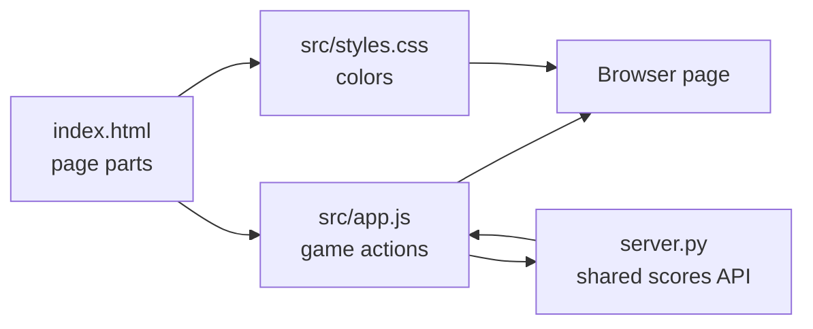
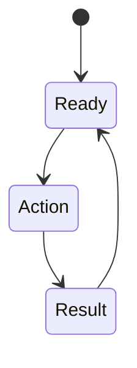

# Mission XX: [MissionName]

## Start Here
1. Run the app.
2. Play one solo round.
3. Understand the entry point.
4. Open the code files.
5. Make one small change.

## Mission Navigation
| Need | Go Here |
| --- | --- |
| I want to run it | How To Run |
| I want to play it | Play It |
| I want to know where the app starts | Entry Point |
| I want to know which file to open | Code Files |
| I want diagrams and function details | CODE_WALKTHROUGH.md |
| I need to create my branch first | SPRK Git Repository User Guide |

## Standard SPRK Guidance
This working repository carries local copies of the shared SPRK guides in `../../../docs/`.

The public source for shared SPRK onboarding and governance is:
`https://github.com/Mr-PI-Bala/SPRK-Welcome`

## Mission Goal
[One short paragraph saying what students are building or playing.]

## Open The App
Code starting point:
`missions/XX-Template-nP/index.html`

## How To Run
```bash
cd missions/XX-Template-nP
python server.py
```
Open the browser link provided in the terminal (usually `http://localhost:8000`).

## Entry Point
Start with `index.html`. It decides what is on the page and loads `app.js` and `styles.css`.

## Code Files
| File | Link | What To Look For |
| --- | --- | --- |
| Page structure | index.html | Title, controls, student-facing text. |
| Game behavior | src/app.js | Main functions and event handlers. |
| Visual design | src/styles.css | Colors, spacing, layout, phone/tablet rules. |
| Shared backend | server.py | API routes and shared classroom state. |
| Deep explanation | CODE_WALKTHROUGH.md | Diagrams, function table, and main flow. |

## How The Files Work Together

Plain version:
`index.html` creates parts -> `styles.css` adds color -> `app.js` listens for clicks -> `server.py` manages state.

## What Each File Does
| File | Student Meaning | Good First Change |
| --- | --- | --- |
| `index.html` | The page skeleton. | Change a heading or instruction. |
| `src/styles.css` | The style file. | Change a color variable. |
| `src/app.js` | The frontend brain. | Change button text or a starting variable. |
| `server.py` | The backend. | Change MAX_SCORES or log messages. |

## App Flow

Plain version: Ready -> Action -> Result -> Ready

## Mode
`nP`: Many players, classroom mode.

## Play It
1. Join the game link.
2. [Step-by-step instructions on how to use the app.]

## Frontend And Backend
- **Frontend (`app.js`):** Shows the page, handles taps, sends data to the server.
- **Backend (`server.py`):** Stores shared classroom state, receives API requests, and broadcasts state to all browsers.
All devices must use the exact same host URL to share state.

## Change It
### Starter Changes
| Challenge | Hint |
| --- | --- |
| Change a color. | Look in `styles.css` for CSS variables. |
| Change text. | Look in `index.html` or `app.js`. |

### Logic Challenges
| Challenge | Hint |
| --- | --- |
| [Logic Challenge] | [Hint pointing to file and function] |

### Level-Up Challenges
| Challenge | Hint |
| --- | --- |
| [Advanced Challenge] | [Hint pointing to multiple files] |

## Show It
Run the changed version and show that the browser display changed.

## Level It Up
Add optional extension ideas here.

## Branch Reminder
Create your branch before editing files.
Guide: SPRK Git Repository User Guide