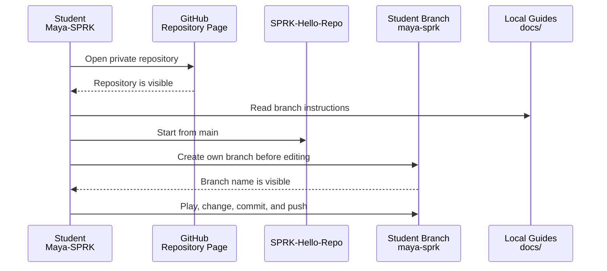

# SPRK-Hello-Repo
SPRK-Hello-Repo is a private mission repository for browser-first coding experiences. Students can pick a mission, try it quickly, then change it in their own branch when they are ready to build.

The missions are independent. The numbering is the suggested classroom try-out order, not a required learning ladder.

## Start Here
1. ~~Ask for access through the public [SPRK-Welcome](https://github.com/Mr-PI-Bala/SPRK-Welcome) repository.~~<br>
   **Victory:** if you can see this private repository, your access request worked.
2. [Create your own branch before changing code](#create-your-branch-before-changing-code).
3. Pick one mission from the Mission Menu.
4. Play the mission first.
5. Make one small change in your own branch.



## Create Your Branch Before Changing Code
Do this before editing files.

Your branch name should be your GitHub username in lowercase.

Example:

```text
maya-sprk
```

### Create A Branch From The GitHub Page
Use this when you are looking at the repository page in the browser.

1. Find the branch dropdown near the top-left of the file list. It usually says `main`.
2. Click the branch dropdown.
3. Type your branch name, such as `<yourname-sprk>`.
4. Choose `Create branch`.
5. Confirm the page now shows your branch name instead of `main`.

### Choose Your Branch Method
Use the method that matches where you are working.

| Where You Are Working | Best Branch Method |
| --- | --- |
| GitHub repository page in a browser | Use the branch dropdown near the file list. |
| Codespaces in browser, including iPad | Use the Codespaces terminal or the VS Code branch control. |
| VS Code Desktop on your laptop | Use the VS Code branch control or the terminal. |
| Terminal only | Use the Git commands below. |

### Create A Branch In Codespaces Browser
Use this when you are inside Codespaces from a browser, including iPad.

Option A: terminal

```bash
git status
git pull
git switch -c <yourname-sprk>
git branch --show-current
git push -u origin <yourname-sprk>
```

Option B: VS Code branch control

1. Look at the bottom-left status bar.
2. Click the current branch name, usually `main`.
3. Choose `Create new branch`.
4. Type your branch name, such as `<yourname-sprk>`.
5. Confirm the bottom-left branch name changed from `main` to your branch.

### Create A Branch In VS Code Desktop
Use this when you cloned the repository to your own laptop and opened it in VS Code.

Option A: VS Code branch control

1. Look at the bottom-left status bar.
2. Click the current branch name, usually `main`.
3. Choose `Create new branch`.
4. Type your branch name, such as `<yourname-sprk>`.
5. Confirm the bottom-left branch name changed from `main` to your branch.

Option B: terminal

```bash
git status
git pull
git switch -c <yourname-sprk>
git branch --show-current
git push -u origin <yourname-sprk>
```

Expected result:

```text
<yourname-sprk>
```

If the result still says `main`, stop and ask for help before changing files.

Detailed guides:

- [SPRK Git Repository User Guide: Create Your Branch](docs/SPRK_Git_Repository_UserGuide.md#create-your-branch)
- [SPRK CodeSpaces User Guide](docs/SPRK_CodeSpaces_UserGuide.md)
- [SPRK VS Code User Guide](docs/SPRK_VSCode_UserGuide.md), including Markdown preview and iPad troubleshooting.

If Codespaces or github.dev shows old files, open the terminal and run:

```bash
git status
git pull
```

Then close and reopen the Markdown preview.

## Mission Menu
| Mission | Name | Mode | What Students Experience | What It Teaches | GitHub Needed To Play? | GitHub Needed To Build? |
| --- | --- | --- | --- | --- | --- | --- |
| 01 | [ReactionRace](missions/01-ReactionRace-nP/docs/MISSION_GUIDE.md) ([open app](missions/01-ReactionRace-nP/index.html)) | nP | A whole-class reaction game where many students join from phones, tablets, Chromebooks, or laptops. | Browser events, timing, player names, backend state, live leaderboard. | No, if a facilitator hosts the game link. | Yes, to edit code, commit, push a branch, or request a merge. |
| 02 | [SnakeGame](missions/02-SnakeGame-1P-nP/docs/MISSION_GUIDE.md) | 1P-nP | A solo snake game that can later grow into shared scores or classroom leaderboard mode. | Canvas/grid thinking, keyboard control, collision, score, game loop, optional backend scores. | No, if a hosted link is provided. | Yes, to customize and contribute changes. |
| 03 | [PingPong](missions/03-PingPong-2P-nP/docs/MISSION_GUIDE.md) | 2P-nP | A two-player paddle game that can later grow into tournament or classroom mode. | Movement, ball physics, win conditions, keyboard control, optional tournament backend. | No, if a hosted link is provided. | Yes, to customize and contribute changes. |
| 04 | [FlashCards](missions/04-FlashCards-1P-nP/docs/MISSION_GUIDE.md) | 1P-nP | A useful school tool for math, vocabulary, or any subject practice. | Data lists, random questions, answer checking, scoring, progress, optional shared question sets. | No, if a hosted link is provided. | Yes, to add decks, logic, and shared features. |
| 05 | [QuizRoom](missions/05-QuizRoom-nP/docs/MISSION_GUIDE.md) | nP | A live classroom quiz room with questions, answers, teams, and scores. | Forms, validation, shared backend state, scoring, team play. | No, if a facilitator hosts the game link. | Yes, to change questions, scoring, and room behavior. |
| 06 | [FourSquare](missions/06-FourSquare-nP/docs/MISSION_GUIDE.md) | nP | A digital version of a playground-style group game with players, turns, and rounds. | Modeling real-world rules, turns, roles, shared game state, backend coordination. | No, if a facilitator hosts the game link. | Yes, to change rules, visuals, and multiplayer behavior. |
| 07 | [SoccerScore](missions/07-SoccerScore-nP/docs/MISSION_GUIDE.md) | nP | A team scoreboard and event tracker for soccer, football, softball, or class games. | Teams, events, timestamps, score updates, shared display, backend API. | No, if a facilitator hosts the game link. | Yes, to change sports, events, stats, and display behavior. |

## Mode Labels
| Label | Meaning |
| --- | --- |
| 1P | One player. |
| 2P | Two players. |
| nP | Many players, usually classroom mode. |
| 1P-nP | Starts as one-player and can grow into many-player mode. |
| 2P-nP | Starts as two-player and can grow into many-player mode. |

## Mission Pattern
Every mission should support the same classroom rhythm:

| Step | Student Action |
| --- | --- |
| Play It | Try the mission before touching the code. |
| Change It | Make one small visible change. |
| Show It | Share the changed version with someone else. |
| Level It Up | Add a feature, rule, visual, or multiplayer behavior. |

## First Classroom Recommendation
Start with `01-ReactionRace` because it lets students participate even if they do not all have GitHub access yet.

A facilitator can run the backend on one laptop and share the browser link with students on other devices. Students without GitHub can still play. Students with GitHub can later create branches and improve the mission.

## Branch Naming
Students should use their GitHub handle as their branch name.

Example pattern:

```text
<yourname-sprk>
```

Example:

```text
maya-sprk
```

## Repository Boundary
This repository is for browser-first hello missions. Advanced 3D, engine-specific, or platform-specific work belongs in a separate repository such as `SPRK-Hello-3D`.
