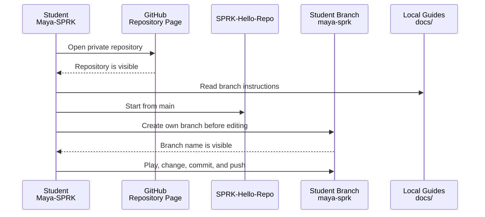

# SPRK-Hello-Repo
SPRK-Hello-Repo is a private mission repository for browser-first coding experiences. Students can pick a mission, try it quickly, then change it in their own branch when they are ready to build.

The missions are independent. The numbering is the suggested classroom try-out order, not a required learning ladder.

## Standard SPRK Guidance
Shared SPRK onboarding and governance starts in the public [SPRK-Welcome](https://github.com/Mr-PI-Bala/SPRK-Welcome) repository.

This repository keeps local copies of the shared guides in [docs](docs/) so students can keep working inside `SPRK-Hello-Repo` after access is approved.

Key repo-wide learning guide:

- [docs/SPRK_Language_Crosswalk.md](docs/SPRK_Language_Crosswalk.md): maps common programming ideas across Python, JavaScript, Java, Go, Lua, and related patterns used in the missions.
- [docs/SPRK_Browser_Mission_Foundation_Guide.md](docs/SPRK_Browser_Mission_Foundation_Guide.md): explains the common browser-mission structure so mission guides only need to describe what is different.
- [docs/SPRK_Browser_Testing_And_Network_Architecture.md](docs/SPRK_Browser_Testing_And_Network_Architecture.md): explains the validation harness, Cursor Cloud flow, and local network hosting model for phones, tablets, and facilitator laptops.
- [docs/SPRK_Guided_Workflow_Helper.md](docs/SPRK_Guided_Workflow_Helper.md): explains the guided Git/GitHub helper that shows status, teaches branch/PR actions, and requires confirmation before doing work.
- [docs/SPRK_Student_AgenticOps_Guide.md](docs/SPRK_Student_AgenticOps_Guide.md): adapts agentic development practices into student-safe SPRK habits for setup, validation, hygiene, and handoff.

Student-safe AgenticOps and coding-agent entry points (public repo only; no private MERIT vault text):

- [MERIT.instructions](MERIT.instructions): canonical mission naming and student-safe MERIT principles for this repository.
- [AgentDraven.instructions](AgentDraven.instructions): classroom mentor tone for students and agents working in SPRK missions.
- [AGENTS.md](AGENTS.md): read order, validation commands, and repository shape for coding agents.
- [docs/SPRK_Student_AgenticOps_Guide.md](docs/SPRK_Student_AgenticOps_Guide.md): MERIT-to-SPRK compare/contrast for students learning how enterprise AgenticOps maps to this repo.

## Start Here
1. ~~Ask for access through the public [SPRK-Welcome](https://github.com/Mr-PI-Bala/SPRK-Welcome) repository.~~<br>
   **Victory:** if you can see this private repository, your access request worked.
2. [Create your own branch before changing code](#create-your-branch-before-changing-code).
3. [Pick one mission from the Mission Menu](#pick-one-mission).
4. [Play the mission first](#play-the-mission-first).
5. [Make one small change in your own branch](#make-one-small-change-in-your-own-branch).

## Create Your Branch Before Changing Code
Do this before editing files.

Your branch name should be your GitHub username in lowercase.

Example:

```text
maya-sprk
```

Quick summary: use the branch path that matches where you are working.

- [Create A Branch From The GitHub Page](#create-a-branch-from-the-github-page): use this when you are only on the GitHub website and want GitHub to make the branch first.
- [Create A Branch In Codespaces Browser](#create-a-branch-in-codespaces-browser): use this when you are editing inside Codespaces in the browser or on iPad.
- [Create A Branch In VS Code Desktop](#create-a-branch-in-vs-code-desktop): use this when the repo is cloned onto your laptop and open in local VS Code.



### Create A Branch From The GitHub Page
Use this when you are looking at the repository page in the browser.

1. Find the branch dropdown near the top-left of the file list. It usually says `main`.
2. Click the branch dropdown.
3. Type your branch name, such as `<yourname-sprk>`.
4. Choose `Create branch`.
5. Confirm the page now shows your branch name instead of `main`.

### Choose Your Branch Method
Use the method that matches where you are working.

| Where You Are Working | Best Branch Method |
| --- | --- |
| GitHub repository page in a browser | Use the branch dropdown near the file list. |
| Codespaces in browser, including iPad | Use the Codespaces terminal or the VS Code branch control. |
| VS Code Desktop on your laptop | Use the VS Code branch control or the terminal. |
| Terminal only | Use the Git commands below. |

### Create A Branch In Codespaces Browser
Use this when you are inside Codespaces from a browser, including iPad.

Option A: terminal

```bash
git status
git pull
git switch -c <yourname-sprk>
git branch --show-current
git push -u origin <yourname-sprk>
```

What each command does:

- `git status`: shows your current branch and current file changes, so you know whether it is safe to branch now.
- `git pull`: downloads the latest shared commits from GitHub so your new branch starts from current `main`.
- `git switch -c <yourname-sprk>`: creates your branch and immediately moves you into it.
- `git branch --show-current`: prints the current branch name so you can confirm you are no longer on `main`.
- `git push -u origin <yourname-sprk>`: uploads the new branch to GitHub and remembers that remote branch for later pushes.

Option B: VS Code branch control

1. Look at the bottom-left status bar.
2. Click the current branch name, usually `main`.
3. Choose `Create new branch`.
4. Type your branch name, such as `<yourname-sprk>`.
5. Confirm the bottom-left branch name changed from `main` to your branch.

Quick use case:

- Use `Option A: terminal` when you want to see the exact Git commands and learn what Git is doing.
- Use `Option B: VS Code branch control` when you want the visual path and do not want to memorize commands yet.

### Create A Branch In VS Code Desktop
Use this when you cloned the repository to your own laptop and opened it in VS Code.

Option A: VS Code branch control

1. Look at the bottom-left status bar.
2. Click the current branch name, usually `main`.
3. Choose `Create new branch`.
4. Type your branch name, such as `<yourname-sprk>`.
5. Confirm the bottom-left branch name changed from `main` to your branch.

Quick use case:

- Use `Option A: VS Code branch control` when you want the simplest desktop workflow and prefer clicking through the UI.

Option B: terminal

```bash
git status
git pull
git switch -c <yourname-sprk>
git branch --show-current
git push -u origin <yourname-sprk>
```

What each command does:

- `git status`: checks your current branch and changed files before you create a new branch.
- `git pull`: updates your local copy of `main` with the latest GitHub changes.
- `git switch -c <yourname-sprk>`: creates your personal branch and switches your terminal into it.
- `git branch --show-current`: confirms that your terminal is now operating on your own branch.
- `git push -u origin <yourname-sprk>`: creates the matching GitHub branch and remembers it for future pushes.

Quick use case:

- Use `Option B: terminal` when you want to practice the Git commands directly or need a path that works the same in any terminal.

Expected result:

```text
<yourname-sprk>
```

If the result still says `main`, stop and ask for help before changing files.

Detailed guides:

- [SPRK Git Repository User Guide: Create Your Branch](docs/SPRK_Git_Repository_UserGuide.md#create-your-branch)
- [SPRK CodeSpaces User Guide](docs/SPRK_CodeSpaces_UserGuide.md)
- [SPRK VS Code User Guide](docs/SPRK_VSCode_UserGuide.md), including Markdown preview and iPad troubleshooting.

If Codespaces or github.dev shows old files, open the terminal and run:

```bash
git status
git pull
```

What each command does:

- `git status`: confirms what branch you are on and whether you already have local changes that could affect the pull.
- `git pull`: downloads and applies the latest GitHub commits so your file tree matches the shared repository state.

Then close and reopen the Markdown preview.

## Pick One Mission
Start in the [Mission Menu](#mission-menu).

Quick summary:

- Pick `01-ReactionRace` if you want the easiest whole-class first mission.
- Pick `02-SnakeGame` if you want a solo game with shared classroom scores.
- Pick one of the later missions when you want different rules, different shared state, or a different gameplay pattern.

Use each mission's `MISSION_GUIDE.md` first, because that guide tells you what the mission does, how to run it, and what concept it teaches.

## Play The Mission First
Play before editing.

Why this matters:

- you learn what the mission is supposed to do before you change it
- you can tell whether your later edit actually changed something
- you understand the difference between the `RealTime`, `X-Ray Vision`, and `Baseline Status` tabs before you start modifying code

Open the mission from the [Mission Menu](#mission-menu), try the default behavior, and read that mission's `MISSION_GUIDE.md` if anything is unclear.

## Make One Small Change In Your Own Branch
After playing the mission, make one small visible change in your branch.

Good first changes:

- rename a title
- change a button label
- change a color
- change one piece of text in the `RealTime` panel
- adjust one score rule or timing value

The point of the first change is not to build everything at once. The point is to prove that you can change the code, test it, and keep that work safely in your own branch.

## Learning Phases
We are structuring the missions into distinct phases:

1. **Phase 1 (Active):** Work on **01-ReactionRace** and **02-SnakeGame**. This phase establishes the shared classroom backend, basic browser device inputs, and frontend-to-backend communication.
2. **Phase 2 (Next):** Explore the remaining 2D logic and team missions (PingPong, FlashCards, QuizRoom, etc.).
3. **Phase 3 (Final):** A full 3D game. Note that advanced 3D, engine-specific, or platform-specific work will belong in a separate repository (such as `SPRK-Hello-3D`) to keep this introductory repository lightweight and accessible.

## Mission Menu
| Mission | Name | Mode | What Students Experience | What It Teaches | GitHub Needed To Play? | GitHub Needed To Build? |
| --- | --- | --- | --- | --- | --- | --- |
| 01 | [ReactionRace](missions/01-ReactionRace-nP/docs/MISSION_GUIDE.md) ([open app](missions/01-ReactionRace-nP/index.html)) | nP | A whole-class reaction game where many students join from phones, tablets, Chromebooks, or laptops. | Browser events, timing, player names, backend state, live leaderboard. | No, if a facilitator hosts the game link. | Yes, to edit code, commit, push a branch, or request a merge. |
| 02 | [SnakeGame](missions/02-SnakeGame-1P-nP/docs/MISSION_GUIDE.md) ([open app](missions/02-SnakeGame-1P-nP/index.html)) | 1P-nP | A solo snake game with shared classroom scores. | Canvas/grid thinking, keyboard control, collision, score, game loop, backend scores. | No, if a hosted link is provided. | Yes, to customize and contribute changes. |
| 03 | [PingPong](missions/03-PingPong-2P-nP/docs/MISSION_GUIDE.md) ([open app](missions/03-PingPong-2P-nP/index.html)) | 2P-nP | A two-player paddle game with shared winners. | Movement, ball physics, win conditions, keyboard control, tournament-style backend scoring. | No, if a hosted link is provided. | Yes, to customize and contribute changes. |
| 04 | [FlashCards](missions/04-FlashCards-1P-nP/docs/MISSION_GUIDE.md) ([open app](missions/04-FlashCards-1P-nP/index.html)) | 1P-nP | A useful school tool for math, vocabulary, or any subject practice. | Data lists, random questions, answer checking, scoring, progress, shared streaks. | No, if a hosted link is provided. | Yes, to add decks, logic, and shared features. |
| 05 | [QuizRoom](missions/05-QuizRoom-nP/docs/MISSION_GUIDE.md) ([open app](missions/05-QuizRoom-nP/index.html)) | nP | A live classroom quiz room with shared current question and scores. | Forms, validation, shared backend state, scoring, team play. | No, if a facilitator hosts the game link. | Yes, to change questions, scoring, and room behavior. |
| 06 | [FourSquare](missions/06-FourSquare-nP/docs/MISSION_GUIDE.md) ([open app](missions/06-FourSquare-nP/index.html)) | nP | A digital version of a playground-style group game with players, turns, and rounds. | Modeling real-world rules, turns, roles, shared game state, backend coordination. | No, if a facilitator hosts the game link. | Yes, to change rules, visuals, and multiplayer behavior. |
| 07 | [SoccerScore](missions/07-SoccerScore-nP/docs/MISSION_GUIDE.md) ([open app](missions/07-SoccerScore-nP/index.html)) | nP | A team scoreboard and event tracker for soccer, football, softball, or class games. | Teams, events, timestamps, score updates, shared display, backend API. | No, if a facilitator hosts the game link. | Yes, to change sports, events, stats, and display behavior. |
| 08 | [SoccerMatch](missions/08-SoccerMatch-nP/docs/MISSION_GUIDE.md) ([open app](missions/08-SoccerMatch-nP/index.html)) | nP | A real shared soccer field where multiple devices join the same live match and control players on both sides. | Shared simulation, device join flow, live canvas game state, player input, ball physics, team play. | No, if a facilitator hosts the game link. | Yes, to tune gameplay, visuals, controls, and multiplayer rules. |
| 10 | [Space Invaders](missions/10-SpaceInvaders-1P-nP/docs/MISSION_GUIDE.md) ([open app](missions/10-SpaceInvaders-1P-nP/index.html)) | 1P-nP | A classic 2D Space Invaders wave that shifts into a 3D rail shooter and then an FPS-style cannon view. | Canvas rendering, state machines, collision, destructible bunkers, camera transitions, unified game state. | No, if a facilitator hosts the game link. | Yes, to tune gameplay, visuals, controls, and dimension rules. |

## Mission Template
The canonical starter scaffold for the next browser-first mission is:

- [missions/XX-Template-nP/docs/MISSION_GUIDE.md](missions/XX-Template-nP/docs/MISSION_GUIDE.md)
- [missions/XX-Template-nP/docs/CODE_WALKTHROUGH.md](missions/XX-Template-nP/docs/CODE_WALKTHROUGH.md)

Use that folder when creating the next mission. Do not start by dropping `index.html`, `app.js`, `server.py`, or mission docs into the repository root.

Template structure:

```text
missions/XX-Template-nP/
  index.html
  server.py
  src/
    app.js
    styles.css
  docs/
    MISSION_GUIDE.md
    CODE_WALKTHROUGH.md
```

Why this template matters:

- it keeps each mission self-contained
- it reuses the shared classroom backend and frontend helpers
- it preserves the stable three-tab pattern:
  - `RealTime`
  - `X-Ray Vision`
  - `Baseline Status`
- it keeps the repository root clean
- it includes the language-crosswalk mindset so each new mission can point students to the exact programming ideas they are seeing

## Mode Labels
| Label | Meaning |
| --- | --- |
| 1P | One player. |
| 2P | Two players. |
| nP | Many players, usually classroom mode. |
| 1P-nP | Starts as one-player and can grow into many-player mode. |
| 2P-nP | Starts as two-player and can grow into many-player mode. |

## Mission Folder Naming
Every playable mission folder under `missions/` must use this pattern:

```text
NN-GameName-<mode-label>
```

Examples:

- `01-ReactionRace-nP`
- `02-SnakeGame-1P-nP`
- `03-PingPong-2P-nP`
- `10-SpaceInvaders-1P-nP`

Rules:

- `NN` is the two-digit mission number used in the menu and tests.
- `GameName` is PascalCase with no spaces (not `Space-Invaders`).
- `<mode-label>` is one of `1P`, `2P`, `nP`, `1P-nP`, or `2P-nP` and must match the mission menu Mode column.
- Do not keep a second folder for the same mission under a different name. One mission, one folder, one Playwright entry in `tests/helpers/start-mission-server.js`.

Full rules live in [MERIT.instructions](MERIT.instructions).

## Mission Pattern
Every mission should support the same classroom rhythm:

| Step | Student Action |
| --- | --- |
| Play It | Try the mission before touching the code. |
| Change It | Make one small visible change. |
| Show It | Share the changed version with someone else. |
| Level It Up | Add a feature, rule, visual, or multiplayer behavior. |

## First Classroom Recommendation
Start with `01-ReactionRace` because it lets students participate even if they do not all have GitHub access yet.

A facilitator can run the backend on one laptop and share the browser link with students on other devices. Students without GitHub can still play. Students with GitHub can later create branches and improve the mission.

## Branch Naming
Students should use their GitHub handle as their branch name.

Example pattern:

```text
<yourname-sprk>
```

Example:

```text
maya-sprk
```

## Repository Boundary
This repository is for browser-first hello missions. Advanced 3D, engine-specific, or platform-specific work belongs in a separate repository such as `SPRK-Hello-3D`.

## Clean Folder Rule
The repository root is for workspace-level files only, such as:

- `README.md`
- `VERSION`
- `package.json`
- `package-lock.json`
- `docs/`
- `tests/`
- `missions/`

Mission-specific files belong inside the mission folder under `missions/`. That includes:

- `index.html`
- `server.py`
- `src/app.js`
- `src/styles.css`
- `docs/MISSION_GUIDE.md`
- `docs/CODE_WALKTHROUGH.md`

## Direct Playwright Testing
SPRK-Hello-Repo now has a direct baseline validation harness for local browser testing against the real Python backends used by the missions.

Automatic setup for forked and branched work:

- `.devcontainer/devcontainer.json` runs `npm run setup:missions` when a GitHub Codespace or compatible dev container is created from this repository.
- `.github/workflows/mission-baseline.yml` runs browser mission validation on pushed branches and pull requests.
- Because those files are committed to the repo, students inherit the setup when they branch or fork this repository.

Install the test tools manually when working outside a dev container:

```bash
npm run setup:missions
```

Run the full browser test suite:

```bash
npm run validate
```

`npm run validate` currently delegates to `npm test`, which runs the full Playwright mission baseline.

Run only the ReactionRace suite:

```bash
npm run test:reactionrace
```

Run only the SnakeGame suite:

```bash
npm run test:snakegame
```

Run one mission at a time:

```bash
npm run test:pingpong
npm run test:flashcards
npm run test:quizroom
npm run test:foursquare
npm run test:soccerscore
npm run test:spaceinvaders
```

Current baseline coverage:

- `01-ReactionRace`
- `02-SnakeGame`
- `03-PingPong`
- `04-FlashCards`
- `05-QuizRoom`
- `06-FourSquare`
- `07-SoccerScore`
- `08-SoccerMatch`
- `10-SpaceInvaders-1P-nP`

Generated validation artifacts:

```text
tests/artifacts/playwright-report/
tests/artifacts/results/latest-status.json
missions/_shared/generated/baseline-status.json
missions/_shared/generated/baseline-status.html
```

Root-folder hygiene:

- Keep the Node workspace files at repo root: `package.json`, `package-lock.json`, and `node_modules/`.
- Keep Playwright code and generated Playwright artifacts under `tests/`.
- Keep only the shared mission-readable baseline files under `missions/_shared/generated/`.

Current baseline mechanism:

- Playwright is the current baseline validator for browser-first SPRK missions.
- Additional validators may be added later.
- Playwright may also be replaced later if another baseline mechanism fits the repository better.

UI convention for browser-first missions:

- Tab 1 is mission-specific `RealTime`, such as `Scoreboard` or `Shared Scores`.
- Tab 2 is always `X-Ray Vision`.
- Tab 3 is always `Baseline Status`.
