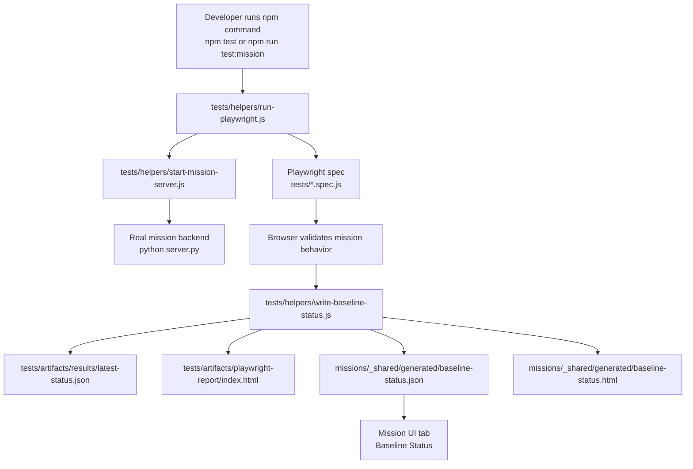
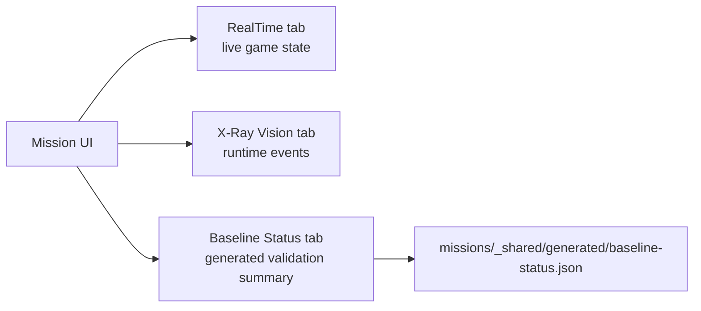
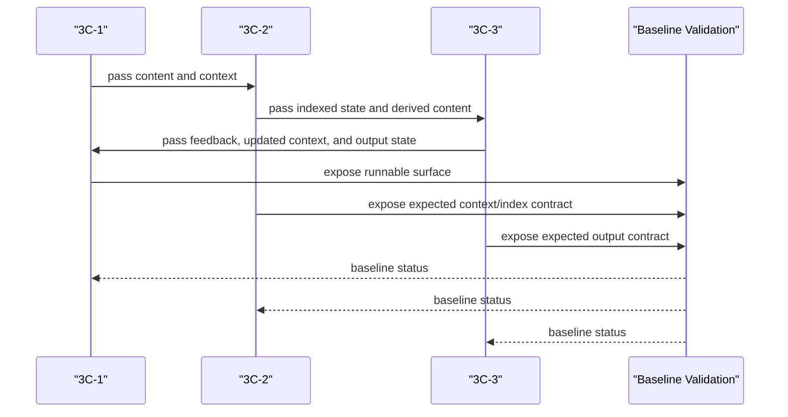

# Baseline Validation And 3C Flow
This document is the pictorial overview for how baseline validation works in `SPRK-Hello-Repo`, where the generated status files live, and how this baseline status is intended to fit into the broader PRD-level `3C` model.

## Baseline Validation Flow
Playwright is the current baseline validation mechanism for browser-first missions in this repository. That is a current implementation choice, not a permanent architectural restriction. Future repositories may add additional validators or replace Playwright if the baseline needs change.



## Runtime UI Flow
The right-side mission panel should follow one stable three-tab model:

- `RealTime`: mission-specific live state such as `Scoreboard` or `Shared Scores`
- `X-Ray Vision`: live runtime/backend/frontend events
- `Baseline Status`: most recent generated validation summary



## Clean Folder Rule
Keep the repository root clean.

- Root is for workspace-level control files only.
- Test code and generated test artifacts belong under `tests/`.
- Mission-consumable generated status files belong under `missions/_shared/generated/`.

Current layout:

```text
package.json
package-lock.json
node_modules/
tests/
  playwright.config.js
  reactionrace.spec.js
  snakegame.spec.js
  helpers/
  artifacts/
missions/
  _shared/
    generated/
```

## 3C PRD Integration
This repository does not yet define the exact expansion of the `3C` names in checked-in docs. Until those names are finalized, the safe PRD-level interpretation is:

- There are three collaborating concerns or components.
- They exchange `content`, `context`, `index/state`, and validation signals.
- `Baseline Status` is the common confidence layer that tells users what was last verified.

The architecture expectation is:



The intent from a PRD perspective is:

- each `3C` should have a clear input contract
- each `3C` should have a clear output contract
- content, context, and index/state handoff should be explicit
- baseline validation should verify those handoffs, not only UI clicks

## What To Open
After a baseline run, inspect these first:

- [tests/artifacts/playwright-report/index.html](../tests/artifacts/playwright-report/index.html)
- [tests/artifacts/results/latest-status.json](../tests/artifacts/results/latest-status.json)
- [missions/_shared/generated/baseline-status.html](../missions/_shared/generated/baseline-status.html)
- [missions/_shared/generated/baseline-status.json](../missions/_shared/generated/baseline-status.json)

## Carry Forward Rule
For future browser-first repositories:

- start with one root Node workspace
- keep test code and generated test artifacts under `tests/`
- keep mission-readable generated baseline files in one shared generated folder
- preserve the `RealTime`, `X-Ray Vision`, `Baseline Status` tab pattern
- allow Playwright to be replaced if a later baseline validator is a better fit
