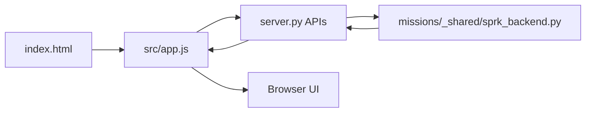

# SPRK Browser Mission Foundation Guide
Use this guide for the parts that should stay common across browser-first SPRK missions.

Mission-specific guides should link here for the baseline pattern, then only explain what is different about that mission.

## What Stays Common
Most browser-first SPRK missions share the same foundation:

- `index.html`: page structure
- `src/app.js`: browser behavior
- `src/styles.css`: mission-specific visuals
- `server.py`: mission backend startup
- `missions/_shared/sprk_app.js`: shared frontend helpers
- `missions/_shared/sprk_touch.js`: shared touch, pointer, and fullscreen helpers for canvas missions
- `missions/_shared/sprk_backend.py`: shared backend behavior

## Mission Folder Naming
Every mission folder under `missions/` must follow:

```text
NN-GameName-<mode-label>
```

Examples: `01-ReactionRace-nP`, `03-PingPong-2P-nP`, `10-SpaceInvaders-1P-nP`.

The mode label (`1P`, `2P`, `nP`, `1P-nP`, `2P-nP`) tells students how many players the mission starts with and whether it can grow into classroom multiplayer. Use PascalCase for `GameName` with no hyphens inside the name.

Canonical rules: [MERIT.instructions](../MERIT.instructions) at the repository root.

## Common Run Pattern
For most missions, the run shape is:

```bash
cd missions/<MissionFolder>
python server.py
```

What each command does:

- `cd missions/<MissionFolder>`: moves the terminal into the mission folder you want to run (for example `missions/10-SpaceInvaders-1P-nP`).
- `python server.py`: starts the local mission backend and serves the mission page plus its shared APIs.

Then open the mission link shown in the terminal.

## Common File Roles
| File | Common Job |
| --- | --- |
| `index.html` | Defines what students see on the page. |
| `src/app.js` | Handles clicks, keys, timers, state updates, and backend calls. |
| `src/styles.css` | Controls layout, color, and responsive mission visuals. |
| `server.py` | Starts the mission server and configures mission title, port, and initial state. |
| `missions/_shared/sprk_app.js` | Shared tabs, score rendering, X-Ray rendering, baseline rendering, and sound helpers. |
| `missions/_shared/sprk_backend.py` | Shared scores, events, state, and file serving logic. |

## Common Frontend And Backend Pattern
Every browser-first mission follows the same broad loop:



ASCII fallback:

```text
index.html -> app.js -> server.py -> shared backend helpers -> browser UI
```

## Common Shared APIs
These routes are the standard shared classroom pattern:

- `/api/state`: shared mission state
- `/api/scores`: shared scoreboard data
- `/api/events`: X-Ray Vision event stream
- `/_shared/generated/baseline-status.json`: latest generated baseline summary

## Common Touch Pattern
Canvas missions should use the shared touch layer instead of inventing per-mission gestures:

- Link `missions/_shared/sprk_touch.css` and `missions/_shared/sprk_touch.js`.
- Call `SPRK_TOUCH.attach({ target: canvas, keys, ... })` with the same `keys` set the keyboard uses.
- Document mission-specific gaps (FPS mouse-look, Soccer Match 2P, and so on) in the mission guide.

Student and facilitator reference: [SPRK_Touch_Control_Guide.md](SPRK_Touch_Control_Guide.md).

## Common Right-Side Panel Pattern
Browser-first missions should keep the stable three-tab model:

- `RealTime`: mission-specific live state
- `X-Ray Vision`: frontend/backend event stream
- `Baseline Status`: most recent generated validation result

Mission guides should only describe the `RealTime` variation when that tab is mission-specific.

## Common Change Loop
Students should usually follow this rhythm:

1. Play it first.
2. Find the entry point.
3. Make one small visible change.
4. Run it again.
5. Share what changed.

## Common Branch Rule
Students change code in their own branch, not `main`.

Use the shared guide:

- [SPRK_Git_Repository_UserGuide.md](SPRK_Git_Repository_UserGuide.md)

## Common Language Crosswalk Rule
Every mission should point to the shared language guide and then call out only the concepts that are especially visible in that mission.

Use:

- [SPRK_Language_Crosswalk.md](SPRK_Language_Crosswalk.md)

## What Should Stay Mission-Specific
These should stay inside each mission guide:

- mission goal
- mission rules
- exact port number
- mission-specific controls
- what the `RealTime` tab shows
- mission-specific starter changes
- mission-specific architecture or game flow diagrams
