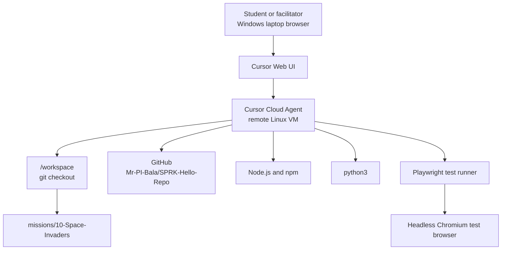
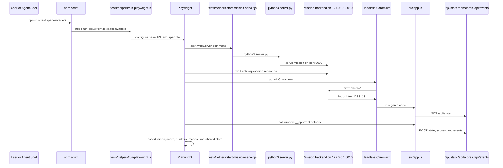
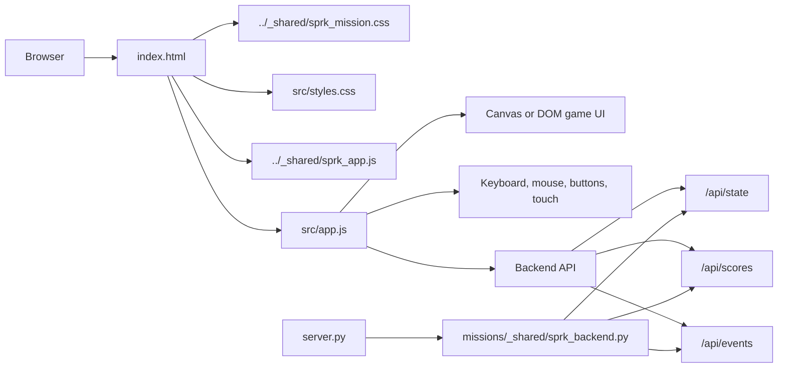
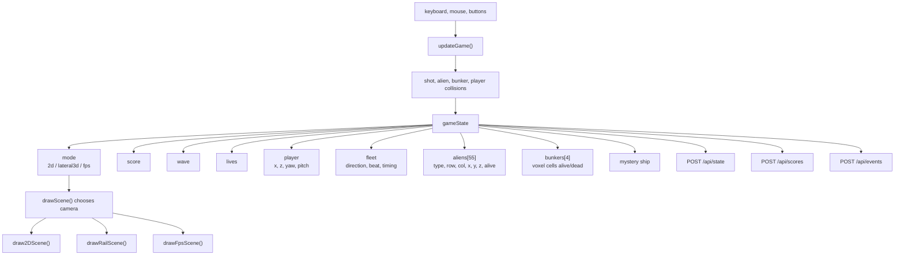
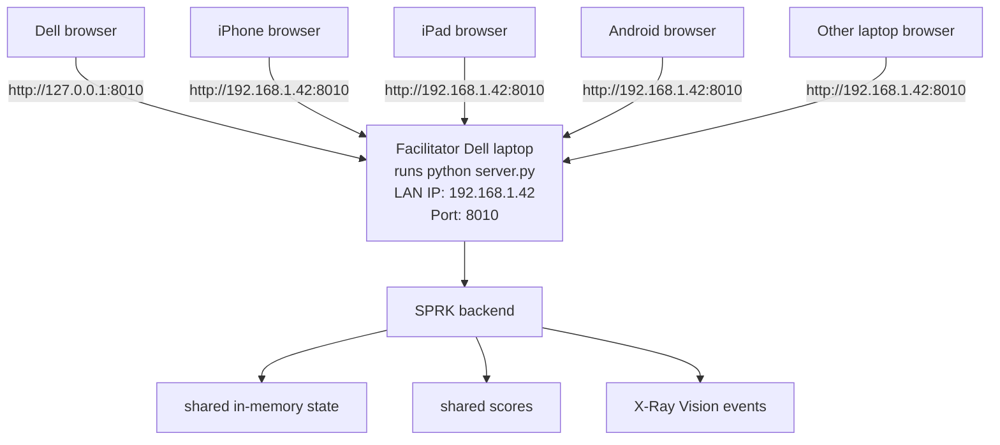

# SPRK Browser Testing And Network Architecture
This guide explains how SPRK browser missions run, how automated validation works, and how a facilitator laptop can host a mission for phones, tablets, and other laptops on the same local network.

Mission 10, `10-Space-Invaders`, is the example throughout this document.

## Quick Vocabulary
| Term | Meaning |
| --- | --- |
| Cursor Cloud Agent | A remote Linux machine controlled through the Cursor browser experience. It edits files, runs commands, commits, pushes, and can run tests. |
| GitHub | The source-code home for the repository. GitHub stores branches, commits, and pull requests. It does not automatically run the live Python game server. |
| Backend | The Python process started by `server.py`. It serves the game page and handles `/api/state`, `/api/scores`, and `/api/events`. |
| Frontend | The browser page: `index.html`, `src/styles.css`, and `src/app.js`. |
| Playwright | The automated browser testing tool used by this repo. |
| Chromium | The browser engine Playwright downloads and controls for tests. |
| `127.0.0.1` / `localhost` | "This same device." It never means "the laptop next to me." |
| LAN IP | The local Wi-Fi or Ethernet address of a machine, such as `192.168.1.42`. Other devices on the same network use this to connect to a facilitator laptop. |

## Big Picture: Browser To Cursor Cloud To GitHub
When you use Cursor in a browser from a Windows laptop, the code usually runs on a remote Cursor Cloud machine, not directly on the laptop in front of you.



Object interaction summary:

1. The user types a request into Cursor in the browser.
2. The Cursor Cloud Agent edits files under `/workspace`.
3. The agent runs shell commands on the remote Linux VM.
4. Git commits and pushes go from the cloud VM to GitHub.
5. Tests run inside the cloud VM unless the repo is cloned and tested locally.

## What The Setup Commands Do
### `npm install`
`npm install` reads the repo-level files:

```text
package.json
package-lock.json
```

It installs JavaScript development tools under:

```text
node_modules/
```

For this repo, the important package is `@playwright/test`, which provides the test runner.

This command does not run the game. It prepares the test tooling.

### `npx playwright install chromium`
Playwright needs an actual browser binary to automate. This command downloads the matching Chromium browser build into the machine's Playwright cache.

This command does not change mission code. It installs the browser that the automated test robot uses.

### `npm run test:spaceinvaders`
This runs the Mission 10 validation harness. In `package.json`, the script points to:

```bash
node tests/helpers/run-playwright.js spaceinvaders
```

The helper selects the Space Invaders mission, starts its backend, launches Playwright, opens Chromium, and runs the assertions in:

```text
tests/spaceinvaders.spec.js
```

## Automated Validation Harness
The test harness starts the real backend and opens the real browser page.



### What Mission 10 Validation Checks
The Space Invaders baseline verifies:

- the page renders
- the shared backend connects
- the game starts with 55 aliens
- destroying an alien changes score and alien count
- fleet acceleration changes as aliens are destroyed
- bunker damage changes shared state
- 2D, 3D rail, and FPS modes preserve score and wave state
- X-Ray Vision and Baseline Status are reachable

## Runtime Architecture For A Browser Mission
Every browser mission uses the same basic shape.



For Mission 10:

```text
missions/10-Space-Invaders/
  index.html
  server.py
  src/app.js
  src/styles.css
  docs/MISSION_GUIDE.md
  docs/CODE_WALKTHROUGH.md
```

## Mission 10 Object Model
Mission 10 keeps one state object for all views. The renderer changes how the state is shown, but the score, wave, aliens, and bunkers stay the same.



Why this matters:

- destroyed aliens stay destroyed after a dimension shift
- bunker damage persists across views
- score continues from 2D into 3D rail and FPS
- tests can inspect a single state machine instead of three separate games

## Running The Game In Cursor Cloud
Use this when the code is running in Cursor's remote environment.

```bash
cd /workspace/missions/10-Space-Invaders
python3 server.py
```

The backend prints a local link like:

```text
http://localhost:8010
```

Inside Cursor Cloud, that means the Cursor Cloud VM. To view it from your laptop browser, open the Cursor port preview or forwarded URL for port `8010`.

Important: `127.0.0.1:8010` on your Windows laptop is your Windows laptop, not the Cursor Cloud VM.

## Running The Game On A Facilitator Laptop
Use this when one laptop in the room should host the mission for nearby phones, tablets, and laptops.

On the facilitator laptop:

```bash
git clone https://github.com/Mr-PI-Bala/SPRK-Hello-Repo.git
cd SPRK-Hello-Repo
git checkout cursor/10-space-invaders-de64
cd missions/10-Space-Invaders
python server.py
```

On some Windows machines, use:

```bash
py server.py
```

The backend binds to:

```text
0.0.0.0:8010
```

That means it listens on all network interfaces for that laptop.

The facilitator laptop can open:

```text
http://127.0.0.1:8010
```

Other devices must use the facilitator laptop's LAN IP, for example:

```text
http://192.168.1.42:8010
```

## Why `127.0.0.1` Does Not Reach The Laptop Next To You
`127.0.0.1` always points back to the device making the request.

| Device typing `http://127.0.0.1:8010` | Where it tries to connect |
| --- | --- |
| Cursor Cloud VM | Cursor Cloud VM |
| Facilitator Dell laptop | Facilitator Dell laptop |
| iPhone | The iPhone itself |
| iPad | The iPad itself |
| Android phone | The Android phone itself |
| Student laptop | That same student laptop |

So if the backend is running on the facilitator Dell laptop, phones and tablets should not use `127.0.0.1`. They should use the Dell's local network address.

## Local Network Object Interaction
This is the classroom or home Wi-Fi model.



Requirements:

1. The facilitator laptop and devices are on the same Wi-Fi.
2. The Wi-Fi allows device-to-device traffic.
3. Windows Firewall allows inbound access to Python on port `8010`.
4. The server terminal stays open.

Guest Wi-Fi networks often block device-to-device traffic. If phones cannot connect, try a non-guest network or a phone hotspot that allows local clients to see each other.

## Finding The Facilitator Laptop IP On Windows
Open PowerShell or Command Prompt:

```bash
ipconfig
```

Look for the Wi-Fi adapter's IPv4 address:

```text
Wireless LAN adapter Wi-Fi:
   IPv4 Address . . . . . . . . . . : 192.168.1.42
```

Then nearby devices open:

```text
http://192.168.1.42:8010
```

Replace `192.168.1.42` with the actual address from the facilitator laptop.

## Cursor Cloud Versus Facilitator Laptop
| Scenario | Where backend runs | Best URL for the host | Best URL for phones/tablets |
| --- | --- | --- | --- |
| Cursor Cloud tryout | Remote Cursor VM | Cursor forwarded port URL | Cursor forwarded port URL, if accessible |
| Dell facilitator local play | Dell laptop | `http://127.0.0.1:8010` | `http://<Dell LAN IP>:8010` |
| Student laptop local experiment | Student laptop | `http://127.0.0.1:8010` | Usually not needed unless that student hosts |

## Troubleshooting Checklist
If the automated test fails:

1. Run `npm install`.
2. Run `npx playwright install chromium`.
3. Run `npm run test:spaceinvaders`.
4. Confirm no other process is already using port `8010`.

If phones/tablets cannot reach a facilitator laptop:

1. Confirm the backend is running.
2. Confirm all devices are on the same Wi-Fi.
3. Use `ipconfig` and connect to the facilitator laptop's IPv4 address.
4. Allow Python through Windows Firewall.
5. Avoid guest Wi-Fi networks that block device-to-device traffic.
6. Try from another laptop browser first, then phones/tablets.

## Command Reference
Run Mission 10 in Cursor Cloud:

```bash
cd /workspace/missions/10-Space-Invaders
python3 server.py
```

Run Mission 10 locally on Windows:

```bash
cd missions/10-Space-Invaders
python server.py
```

or:

```bash
py server.py
```

Install test tools:

```bash
npm install
```

Install the Playwright test browser:

```bash
npx playwright install chromium
```

Run Mission 10 validation:

```bash
npm run test:spaceinvaders
```
