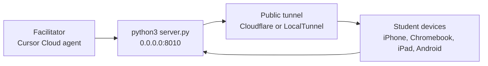

# SPRK Cloud Facilitator Hosting Guide

Use this guide when a **facilitator hosts the game backend in Cursor Cloud** (or any remote Linux environment) and students join from **iPhone, iPad, Chromebook, Android, or any browser** — even when they are **not** on the same Wi‑Fi as a laptop.

This is different from the [SPRK Classroom Network Test Guide](SPRK_Classroom_Network_Test_Guide.md) **local network** model, where students open `http://<facilitator-laptop-ip>:<port>`.

## When To Use This Guide

| Situation | Use this cloud tunnel guide | Use local LAN guide instead |
| --- | --- | --- |
| Facilitator has no laptop, only phone/tablet + Cursor | Yes | No |
| Backend runs in **Cursor Cloud** or Codespaces | Yes | No |
| School Wi‑Fi blocks device-to-device traffic | Often yes | Sometimes no |
| Everyone in the same room on one shared hotspot to one laptop | No | Yes |

## Big Picture

The mission backend still runs on `python3 server.py` and listens on `0.0.0.0` inside the remote VM. Phones cannot reach that VM with `localhost` or a raw cloud IP. A **public tunnel** creates an HTTPS link that forwards student browsers into the running backend.



Object interaction summary:

1. Facilitator starts `server.py` in the cloud workspace.
2. Facilitator starts a tunnel process that points at `http://127.0.0.1:<port>`.
3. Tunnel prints a public `https://...` URL.
4. Facilitator shares that **one URL** with the class.
5. Every device that opens the same URL shares the same backend state (scores, multiplayer, events).

## Mission Port Reference

| Mission | Folder | Default port |
| --- | --- | --- |
| 01 Reaction Race | `missions/01-ReactionRace-nP` | 8000 |
| 02 Snake Game | `missions/02-SnakeGame-1P-nP` | 8002 |
| 03 Ping Pong | `missions/03-PingPong-2P-nP` | 8003 |
| 04 Flash Cards | `missions/04-FlashCards-1P-nP` | 8004 |
| 05 Quiz Room | `missions/05-QuizRoom-nP` | 8005 |
| 06 Four Square | `missions/06-FourSquare-nP` | 8006 |
| 07 Soccer Score | `missions/07-SoccerScore-nP` | 8007 |
| 08 Soccer Match | `missions/08-SoccerMatch-nP` | 8008 |
| 10 Space Invaders | `missions/10-SpaceInvaders-1P-nP` | 8010 |

Replace `8010` in the examples below with your mission port when needed.

## Step 1 — Start The Backend

From the repository root in Cursor Cloud:

```bash
cd missions/10-SpaceInvaders-1P-nP
python3 server.py
```

Leave this terminal running. You should see a line like:

```text
Local link: http://localhost:8010
```

That link only works **inside** the cloud VM. Students still need the public tunnel URL from Step 2.

## Step 2 — Open A Public Tunnel (Recommended: Cloudflare)

### What Cloudflare Quick Tunnel Does

`cloudflared` opens an outbound connection from the cloud VM to Cloudflare. Cloudflare gives you a temporary public hostname (ending in `.trycloudflare.com`) that forwards HTTPS traffic to your local `server.py` port. No router setup, no firewall holes, and no IP address for students to type.

This is the approach that worked when LocalTunnel showed **502 Bad Gateway** after entering the wrong IP.

### One-Time Install (in Cursor Cloud)

```bash
curl -sL https://github.com/cloudflare/cloudflared/releases/latest/download/cloudflared-linux-amd64 -o /tmp/cloudflared
chmod +x /tmp/cloudflared
/tmp/cloudflared --version
```

### Start The Tunnel (second terminal)

```bash
/tmp/cloudflared tunnel --url http://127.0.0.1:8010
```

Or use the repo helper (same behavior):

```bash
bash missions/_shared/tools/sprk_public_tunnel.sh 8010
```

Copy the `https://....trycloudflare.com` URL from the output. Share **only that URL** with students.

### Student Steps (iPhone, Chromebook, any device)

1. Open the shared `https://....trycloudflare.com` link in a normal browser (Safari, Chrome, etc.).
2. Wait a few seconds on first load.
3. Play the mission. Everyone on the same link shares one backend.

### Keep Both Processes Running

| Process | Must stay open |
| --- | --- |
| `python3 server.py` | Yes — this is the game backend |
| `cloudflared tunnel ...` | Yes — this is the public link |

If either terminal stops, students lose access until you restart it and share a **new** URL (see [Friendly And Semi-Permanent Links](#friendly-and-semi-permanent-links)).

## Step 2 — Alternative: LocalTunnel

LocalTunnel is a Node-based option. It can work, but many phones hit an **IP reminder page** first. Entering the wrong IP causes **502 Bad Gateway**.

### Start LocalTunnel

```bash
npx --yes localtunnel --port 8010
```

Copy the `https://....loca.lt` URL.

### If LocalTunnel Asks For An IP

1. On the **student phone**, open [https://ifconfig.me](https://ifconfig.me) and copy the number shown.
2. Paste **that** number into the LocalTunnel page.
3. Do **not** use `127.0.0.1`, the cloud VM IP, or the facilitator home router IP from a different network.

Prefer Cloudflare when you want to avoid this step.

## Compare The Two Tunnel Options

| | Cloudflare Quick Tunnel | LocalTunnel (`loca.lt`) |
| --- | --- | --- |
| Student URL pattern | `https://*-*.trycloudflare.com` | `https://*-*.loca.lt` |
| IP typing on phone | Usually not required | Often required |
| Wrong IP entered | N/A | **502 Bad Gateway** |
| Install | Download `cloudflared` binary once | `npx` (Node already in repo setup) |
| Best for class | **Recommended** | Backup / quick test |

## What Does Not Work For Students

| URL students might try | Why it fails |
| --- | --- |
| `http://localhost:8010` | Points at the phone itself, not the cloud backend |
| `http://127.0.0.1:8010` | Same as localhost |
| `http://34.x.x.x:8010` (cloud public IP) | Cloud VMs usually do not expose mission ports on the public internet |
| Cursor Desktop **plug icon** forward to `localhost` | Forwards to a **laptop running Cursor Desktop**, not to a phone-only workflow |

See also [SPRK Browser Testing And Network Architecture](SPRK_Browser_Testing_And_Network_Architecture.md#why-127001-does-not-reach-the-laptop-next-to-you).

## Friendly And Semi-Permanent Links

### Short Answer

| Link type | Friendly? | Same URL every class? |
| --- | --- | --- |
| `trycloudflare.com` (quick tunnel) | Random words each start | **No** — new URL when tunnel restarts |
| `loca.lt` (LocalTunnel) | Random words each start | **No** |
| **bit.ly** (or similar) you control | **Yes** — you pick `bit.ly/sprk-invaders` | **Yes for the shortcut** — you **update the destination** when the tunnel URL changes |
| Cloudflare **named tunnel** + your domain | **Yes** — e.g. `play.yourschool.org` | **Yes**, with Cloudflare account setup |

Quick tunnels are **session links**, not permanent hosting. Treat them like a classroom session password: valid while the facilitator keeps both processes running.

### Recommended Classroom Pattern: bit.ly (Or Similar)

1. Create one short link you control, for example `https://bit.ly/sprk-space-invaders`.
2. Start `python3 server.py` and `cloudflared` as above.
3. Copy the new `https://....trycloudflare.com` URL.
4. In bit.ly, set the short link **destination** to that URL.
5. Students always type or bookmark the **same** bit.ly link.
6. Next session: repeat steps 2–4 when the Cloudflare URL changes.

Students see a stable name; you update the behind-the-scenes destination when needed.

### Optional: Semi-Permanent Cloudflare Named Tunnel

For a URL that stays the same without updating bit.ly every session, use a [Cloudflare Tunnel](https://developers.cloudflare.com/cloudflare-one/connections/connect-networks/) with:

- A free Cloudflare account
- A hostname you own (for example `sprk.yourdomain.org`)
- A named tunnel configuration stored in the cloud VM or facilitator machine

That setup is beyond this quick classroom guide. Use quick tunnels + bit.ly for SPRK tryouts; move to named tunnels when a school wants year-long stable links.

### LocalTunnel Custom Subdomain

`npx localtunnel --port 8010 --subdomain my-sprk-class` only works when that subdomain is available and may still change between sessions. Do not rely on it as a permanent class link without testing the same day.

## Facilitator Checklist

Before class:

- [ ] Backend starts: `python3 server.py` in the mission folder
- [ ] Tunnel starts and prints `https://...`
- [ ] Open the tunnel URL on one student device (phone or Chromebook) and confirm the game loads
- [ ] Update bit.ly (if used) to the current tunnel URL
- [ ] Post the **short** class link in chat or on the board

During class:

- [ ] Keep both terminals/sessions running
- [ ] If the tunnel dies, restart tunnel, copy new URL, update bit.ly, tell students to refresh

After class:

- [ ] Stop tunnel and server (Ctrl+C) so the public link goes offline

## Troubleshooting

| Problem | Try this |
| --- | --- |
| **502 Bad Gateway** on `loca.lt` after entering IP | Wrong IP; use Cloudflare instead, or use the phone’s real public IP from [ifconfig.me](https://ifconfig.me) |
| Page loads but game API fails | Confirm `server.py` is still running on the same port the tunnel targets |
| Tunnel URL worked earlier, now fails | Quick tunnel ended; restart `cloudflared` and share the **new** URL (update bit.ly) |
| Only facilitator sees the game | Students must use the **tunnel** URL, not `localhost` |
| Two different links, two scoreboards | Everyone must use the **same** shared URL |

## Related Guides

- [SPRK Classroom Network Test Guide](SPRK_Classroom_Network_Test_Guide.md) — same-room Wi‑Fi / laptop IP hosting
- [SPRK Browser Testing And Network Architecture](SPRK_Browser_Testing_And_Network_Architecture.md) — validation harness and address tables
- [Mission 10 guide](../missions/10-SpaceInvaders-1P-nP/docs/MISSION_GUIDE.md) — running Space Invaders
