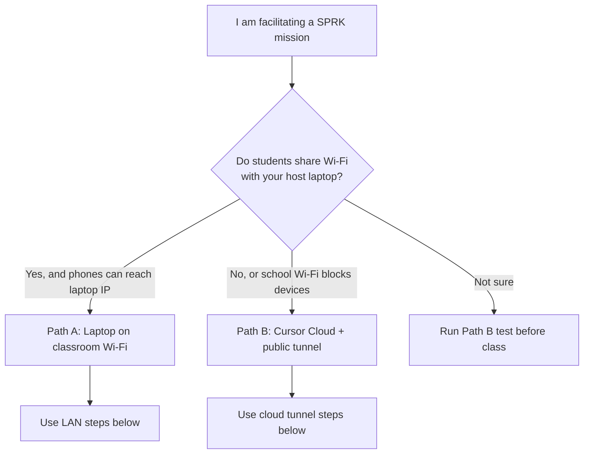

# SPRK Facilitator Guide

Documentation hub: [docs/README.md](README.md). Section links: [SPRK_Documentation_Links_Guide.md](SPRK_Documentation_Links_Guide.md).

This guide is for **teachers, mentors, and lab hosts** who run a SPRK browser mission for a class. Students on **iPhone, iPad, Chromebook, Android, or laptop** open one shared link and play against the **same** backend (scores, multiplayer state, quiz room, and so on).

You do **not** need every student to have GitHub access to **play**. GitHub is for students who later edit code, branch, and open pull requests.


## Table of contents

- [Start Here — Pick Your Hosting Path](#start-here-pick-your-hosting-path) [[#Start Here — Pick Your Hosting Path]] (obsidian)
- [One-Page Facilitator Cheat Sheet](#one-page-facilitator-cheat-sheet) [[#One-Page Facilitator Cheat Sheet]] (obsidian)
- [What A Facilitator Does](#what-a-facilitator-does) [[#What A Facilitator Does]] (obsidian)
- [Mission Port Table](#mission-port-table) [[#Mission Port Table]] (obsidian)
- [Path A — Facilitator Laptop On Classroom Wi-Fi](#path-a-facilitator-laptop-on-classroom-wi-fi) [[#Path A — Facilitator Laptop On Classroom Wi-Fi]] (obsidian)
- [Path B — Facilitator In Cursor Cloud + Public Tunnel](#path-b-facilitator-in-cursor-cloud-public-tunnel) [[#Path B — Facilitator In Cursor Cloud + Public Tunnel]] (obsidian)
- [Friendly Class Link (bit.ly Or Similar)](#friendly-class-link-bit-ly-or-similar) [[#Friendly Class Link (bit.ly Or Similar)]] (obsidian)
- [What To Tell The Class (30-Second Script)](#what-to-tell-the-class-30-second-script) [[#What To Tell The Class (30-Second Script)]] (obsidian)
- [Facilitator Checklist (Full)](#facilitator-checklist-full) [[#Facilitator Checklist (Full)]] (obsidian)
- [Classroom Fallbacks](#classroom-fallbacks) [[#Classroom Fallbacks]] (obsidian)
- [Cursor-Specific Notes For Facilitators](#cursor-specific-notes-for-facilitators) [[#Cursor-Specific Notes For Facilitators]] (obsidian)
- [Touch Devices (iPhone, iPad, Chromebook)](#touch-devices-iphone-ipad-chromebook) [[#Touch Devices (iPhone, iPad, Chromebook)]] (obsidian)
- [Related Guides](#related-guides) [[#Related Guides]] (obsidian)
- [Quick Command Reference](#quick-command-reference) [[#Quick Command Reference]] (obsidian)

## Start Here — Pick Your Hosting Path



| Path | Best when | Students open | Deep dive |
| --- | --- | --- | --- |
| **A — Laptop LAN** | You have a Windows/Mac/Linux laptop on the same network as students | `http://<laptop-ip>:<port>` | [Classroom Network Test Guide](SPRK_Classroom_Network_Test_Guide.md) |
| **B — Cloud + tunnel** | Backend runs in **Cursor Cloud**, or school Wi-Fi blocks device-to-device traffic | `https://....trycloudflare.com` or your **bit.ly** | [Cloud Facilitator Hosting Guide](SPRK_Cloud_Facilitator_Hosting_Guide.md) |

---

## One-Page Facilitator Cheat Sheet

Print or keep this open during class.

### Before class (15 minutes)

| Step | Path A — Laptop LAN | Path B — Cursor Cloud + tunnel |
| --- | --- | --- |
| 1. Choose mission | Note folder and port (see [mission ports](#mission-port-table) [[#Mission Port Table]] (obsidian)) | Same |
| 2. Start backend | `cd missions/<mission>` then `python3 server.py` | Same, in Cursor Cloud terminal |
| 3. Publish link | `ipconfig` → share `http://<IPv4>:<port>` | `bash missions/_shared/tools/sprk_public_tunnel.sh <port>` → share `https://....trycloudflare.com` |
| 4. Stable short link (optional) | bit.ly → destination = laptop URL | bit.ly → destination = tunnel URL (update each session) |
| 5. Smoke test | Open link on **one student device** | Same |

### During class

- Share **one** link only. Different links = different games.
- Keep the backend terminal **running**.
- Path B: keep the **tunnel** terminal running too.
- Tell students: use **Safari or Chrome**, not `localhost`.

### After class

- Press **Ctrl+C** in server (and tunnel) terminals.
- Path B: the public URL stops working until you start a new tunnel.

### Never give students these URLs

| Bad URL | Why |
| --- | --- |
| `http://localhost:8010` | Means “this device,” not your host |
| `http://127.0.0.1:8010` | Same problem |
| Cloud VM public IP + port | Usually blocked; use tunnel instead |
| Two different tunnel links | Splits the class into separate games |

---

## What A Facilitator Does

| Role | You handle | Students handle |
| --- | --- | --- |
| Host | Run `server.py`, share the class link, keep processes alive | Open the link, enter a display name, play |
| Network | Pick Path A or B, test before class | Connect to your link (Wi-Fi or cellular is fine for Path B) |
| Git / code | Optional: show repo, branches, PRs for coders | Play without GitHub; coders use their own branch later |
| Troubleshooting | Restart server/tunnel, update bit.ly, re-post link | Refresh browser, confirm same link as everyone else |

Facilitator success looks like:

1. Every device loads the mission page.
2. Actions on one device show up on others (shared scoreboard, state, or room).
3. You can pause and explain without the backend crashing.

---

## Mission Port Table

| Mission | Folder | Port |
| --- | --- | --- |
| 01 Reaction Race | `missions/01-ReactionRace-nP` | 8000 |
| 02 Snake Game | `missions/02-SnakeGame-1P-nP` | 8002 |
| 03 Ping Pong | `missions/03-PingPong-2P-nP` | 8003 |
| 04 Flash Cards | `missions/04-FlashCards-1P-nP` | 8004 |
| 05 Quiz Room | `missions/05-QuizRoom-nP` | 8005 |
| 06 Four Square | `missions/06-FourSquare-nP` | 8006 |
| 07 Soccer Score | `missions/07-SoccerScore-nP` | 8007 |
| 08 Soccer Match | `missions/08-SoccerMatch-nP` | 8008 |
| 10 Space Invaders | `missions/10-SpaceInvaders-1P-nP` | 8010 |

Example for Mission 10:

```bash
cd missions/10-SpaceInvaders-1P-nP
python3 server.py
```

---

## Path A — Facilitator Laptop On Classroom Wi-Fi

Use when students and your laptop are on the **same** network and phones can reach your laptop IP.

### Facilitator steps

1. Clone or open `SPRK-Hello-Repo` on the host laptop.
2. Start the mission:

   ```bash
   cd missions/01-ReactionRace-nP
   python3 server.py
   ```

   On Windows you may use `python server.py` or `py server.py`.

3. Find the laptop IPv4 address:

   ```powershell
   ipconfig
   ```

   Example result: `192.168.137.1`

4. Share with the class:

   ```text
   http://192.168.137.1:8000
   ```

   Replace the IP and port with yours.

5. On the host laptop you may use `http://127.0.0.1:8000` — students must **not**.

### Student steps (read aloud)

1. Connect to the same Wi-Fi as the facilitator (unless told otherwise).
2. Open the link the facilitator posted in **Chrome or Safari**.
3. Enter your player name and play.

### Path A troubleshooting

| Problem | Fix |
| --- | --- |
| Phone cannot load page | Confirm same Wi-Fi; try laptop hotspot; check Windows Firewall for Python |
| `localhost` on phone fails | Expected — use the facilitator `http://<ip>:<port>` link |
| Guest Wi-Fi | Often blocks device-to-device traffic — switch network or use Path B |

Full checklist: [SPRK Classroom Network Test Guide](SPRK_Classroom_Network_Test_Guide.md)

---

## Path B — Facilitator In Cursor Cloud + Public Tunnel

Use when the backend runs in **Cursor Cloud** (or Codespaces), or Path A fails because the school network isolates devices.

### How it works (short)

1. `python3 server.py` runs inside the cloud VM on port `8010` (or your mission port).
2. **Cloudflare Quick Tunnel** (`cloudflared`) creates a public `https://....trycloudflare.com` URL that forwards into that port.
3. Students on **any** network open that HTTPS link on any browser.

Detailed tunnel steps, LocalTunnel backup, and IP-gate warnings: [SPRK Cloud Facilitator Hosting Guide](SPRK_Cloud_Facilitator_Hosting_Guide.md)

### Facilitator steps (recommended — Cloudflare)

**Terminal 1 — backend**

```bash
cd missions/10-SpaceInvaders-1P-nP
python3 server.py
```

Leave running.

**Terminal 2 — tunnel**

```bash
bash missions/_shared/tools/sprk_public_tunnel.sh 8010
```

Copy the line like:

```text
https://something-words.trycloudflare.com
```

Share **that** URL with the class (or point your bit.ly at it).

### Student steps (read aloud)

1. Open the facilitator’s link in **Safari or Chrome** (not inside a random in-app browser if you can avoid it).
2. Wait a few seconds on first load.
3. Enter your player name and play.
4. If the page breaks, ask the facilitator to confirm the server is still running and whether the link was updated.

### Path B troubleshooting

| Problem | Fix |
| --- | --- |
| **502 Bad Gateway** on `loca.lt` | Wrong IP on LocalTunnel page — switch to Cloudflare tunnel |
| Worked earlier, dead now | Restart tunnel; share **new** URL; update bit.ly |
| Two scoreboards | Class used two different URLs — everyone must use the same link |

---

## Friendly Class Link (bit.ly Or Similar)

Quick tunnel URLs change when you restart `cloudflared`. A **short link you control** stays easy for students to remember.

### Setup once

1. Create an account on [bit.ly](https://bitly.com) (or TinyURL, your school shortener, etc.).
2. Create a short link, for example `https://bit.ly/sprk-play`.

### Every class session

| Step | Action |
| --- | --- |
| 1 | Start `python3 server.py` |
| 2 | Start tunnel (Path B) or confirm laptop IP (Path A) |
| 3 | Copy the full URL students should use |
| 4 | Edit the bit.ly **destination** to that URL |
| 5 | Post only `https://bit.ly/sprk-play` on the board |

Students always type the same short name. You update where it points.

### Semi-permanent options

| Method | Student sees | Facilitator maintenance |
| --- | --- | --- |
| bit.ly | Same short link every time | Update destination when tunnel URL changes |
| Cloudflare named tunnel + school domain | e.g. `play.yourschool.org` | One-time Cloudflare setup; URL stable across sessions |
| Raw `trycloudflare.com` | Long random URL each session | Copy new URL every class |

For most SPRK classrooms, **bit.ly + Cloudflare quick tunnel** is the sweet spot.

---

## What To Tell The Class (30-Second Script)

> “Open this one link on your phone or Chromebook: **[your bit.ly or tunnel URL]**.
> Use Safari or Chrome. Do not type localhost.
> Pick a player name and play. Everyone on this link is in the same game.”

For Quiz Room, add:

> “Wait for me to press Next — we stay on the same question together.”

---

## Facilitator Checklist (Full)

### One week before

- [ ] Pick the mission from the [README mission menu](../README.md#mission-menu) [[README#Mission Menu]] (obsidian)
- [ ] Read that mission’s `docs/MISSION_GUIDE.md`
- [ ] Decide Path A or Path B
- [ ] Run a four-device test (see [Classroom Network Test Guide](SPRK_Classroom_Network_Test_Guide.md#four-device-test) [[docs/SPRK_Classroom_Network_Test_Guide#Four Device Test]] (obsidian))

### One day before

- [ ] Create bit.ly (optional)
- [ ] Confirm Python/`python3` works on host or Cursor Cloud
- [ ] For Path B: confirm `sprk_public_tunnel.sh` prints a working URL

### Class start

- [ ] Start backend
- [ ] Start tunnel (Path B) or verify IP (Path A)
- [ ] Update bit.ly destination
- [ ] Test on one student device
- [ ] Post link on board / chat / projector

### If something breaks mid-class

1. Confirm `server.py` terminal is still running.
2. Path B: confirm tunnel terminal is still running.
3. Restart tunnel if needed; post **new** URL; update bit.ly.
4. Ask all students to refresh the browser.
5. If network is hopeless: projector mode + one driver (see fallbacks below).

### After class

- [ ] Stop server and tunnel (Ctrl+C)
- [ ] Note issues for the next facilitator in your class notes or GitHub issue

---

## Classroom Fallbacks

Use in this order:

```text
Path A — school Wi-Fi to laptop IP
  |
  v
Path B — Cursor Cloud + public tunnel (any student network)
  |
  v
Projector + one driver laptop
  |
  v
Paper roles + live demo (students still design rules and report bugs)
```

No student should be passive because their device cannot connect. Pair students with a teammate who has a working browser.

---

## Cursor-Specific Notes For Facilitators

| Topic | Guidance |
| --- | --- |
| **iPhone only, no laptop** | Use Path B in Cursor Cloud; share tunnel URL or bit.ly |
| **Cursor Desktop plug icon** | Forwards to **your laptop’s** `localhost` — not a phone URL |
| **cursor.com/agents on phone** | Control the agent; use tunnel URL for students to **play** |
| **Codespaces** | Same pattern as Path B; use Ports tab or a tunnel |

Architecture reference: [SPRK Browser Testing And Network Architecture](SPRK_Browser_Testing_And_Network_Architecture.md)

---

## Touch Devices (iPhone, iPad, Chromebook)

Students can play many missions with **touch** instead of a keyboard:

- Drag on the canvas to move (or drag on the player in Space Invaders for magnetic tracking).
- **Quick tap** or a **second finger** for the primary action (same as Space).
- **Triple-tap** the play area for fullscreen.

Full matrix, two-player limits, and unsupported keys: [SPRK Touch Control Guide](SPRK_Touch_Control_Guide.md).

**Soccer Match (Mission 08):** one phone cannot replace two full keyboards — use **two devices** on the same class link or keyboards at the host.

## Related Guides

| Guide | Use when |
| --- | --- |
| [SPRK Touch Control Guide](SPRK_Touch_Control_Guide.md) | iPhone/touch gestures, two-player touch limits, fullscreen |
| [SPRK Cloud Facilitator Hosting Guide](SPRK_Cloud_Facilitator_Hosting_Guide.md) | Tunnel commands, Cloudflare vs LocalTunnel, link permanence |
| [SPRK Classroom Network Test Guide](SPRK_Classroom_Network_Test_Guide.md) | Wi-Fi, hotspot, four-device test, LINKPORT notes |
| [SPRK Browser Testing And Network Architecture](SPRK_Browser_Testing_And_Network_Architecture.md) | Why `127.0.0.1` fails, validation, diagrams |
| [README mission menu](../README.md#mission-menu) [[README#Mission Menu]] (obsidian) | Choose a mission |
| [AgentDraven.instructions](../AgentDraven.instructions) | Mentor tone for agent-assisted classes |

---

## Quick Command Reference

**Backend (all paths)**

```bash
cd missions/<NN-MissionName-mode>
python3 server.py
```

**Cloud tunnel (Path B)**

```bash
bash missions/_shared/tools/sprk_public_tunnel.sh <port>
```

**Windows laptop IP (Path A)**

```powershell
ipconfig
```
