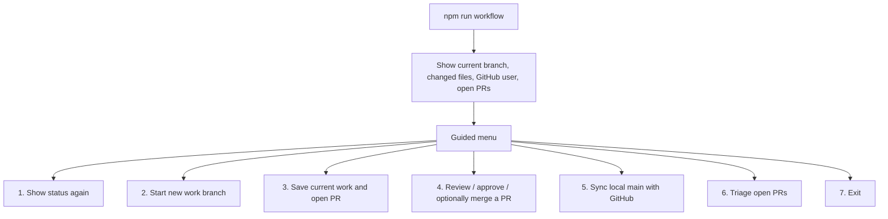
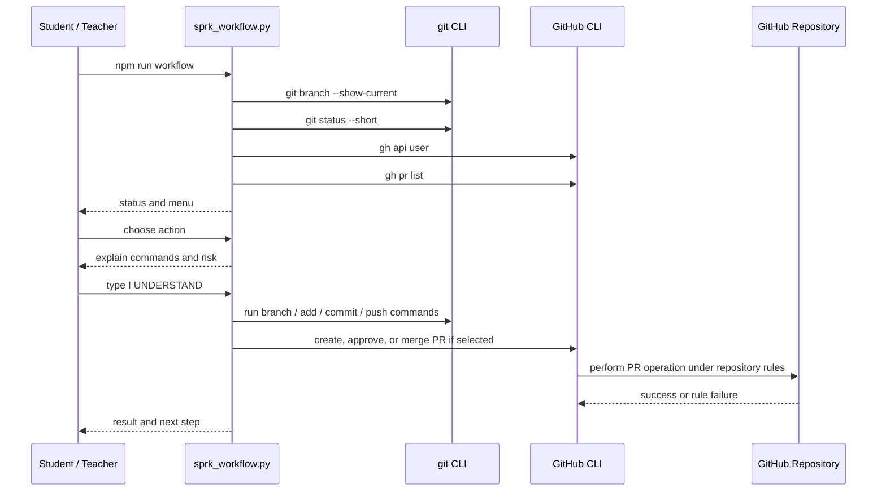

# SPRK Guided Workflow Helper
This helper is a learning tool for Git and GitHub workflow. It does not hide the workflow; it shows status first, explains what will happen, and asks for explicit confirmation before it changes anything.

Script location:

```text
missions/_shared/tools/sprk_workflow.py
```

Run from the repository root:

```bash
npm run workflow
```

The npm script uses `python3` because Cursor Cloud and most Linux/macOS environments expose Python that way.

If npm is not available, run directly on Linux/macOS/Cursor Cloud:

```bash
python3 missions/_shared/tools/sprk_workflow.py
```

On Windows, use whichever Python launcher is installed:

```bash
py missions/_shared/tools/sprk_workflow.py
```

or:

```bash
python missions/_shared/tools/sprk_workflow.py
```


## Table of contents

- [Default Behavior](#default-behavior) [[#Default Behavior]] (obsidian)
- [Menu Options](#menu-options) [[#Menu Options]] (obsidian)
- [Why This Is Safer Than The Old Experiment](#why-this-is-safer-than-the-old-experiment) [[#Why This Is Safer Than The Old Experiment]] (obsidian)
- [Object Interaction Diagram](#object-interaction-diagram) [[#Object Interaction Diagram]] (obsidian)
- [Command Reference](#command-reference) [[#Command Reference]] (obsidian)
- [Important Notes](#important-notes) [[#Important Notes]] (obsidian)

## Default Behavior
By default, the helper shows status and then opens a menu.



Every menu screen reminds you: **`ay` / `ya` = all yes**, **`an` / `na` = all no** (see MERIT.instructions).

## Menu Options
| Option | Who Should Use It | What It Does | Confirmation Required |
| --- | --- | --- | --- |
| Show status | Everyone | Prints branch, changed files, GitHub user, and open PRs (points to option 6 for stale drafts). | No |
| Start new work branch | Student or agent | Syncs `main` from GitHub (with per-file prompts if needed), then creates a new branch. | Yes |
| Save current work and open PR | Student or agent | Shows changed files, stages all current changes, commits, pushes, and opens a PR. | Yes |
| Review / approve / optionally merge PR | Teacher/admin/maintainer | Shows PR details, approves it, and optionally merges it. Use **after option 6** when triage says merge is safe. | Yes, with extra warning for self-approval |
| Sync local main with GitHub | Student or facilitator | Lists uncommitted files, asks **per file** whether to discard local edits (`y`/`n`/`ay`/`ya`/`an`/`na`), then updates `main`. | Yes |
| Triage open PRs | Maintainer / facilitator | Compares each open PR to `main`, prints verdict (superseded, stale, portable), can **close without merge**, or **cherry-pick** commits onto a new branch. | Yes for close/port |

### Interactive shortcuts (`y` / `n` / `ay` / `ya` / `an` / `na`)

The helper prints this block at startup and before file-by-file or PR-by-PR questions:

| You type | Meaning |
| --- | --- |
| `y` or `yes` | Yes for **this item only** |
| `n` or `no` | No for **this item only** |
| `ay` or `ya` | **All yes** for this item and every remaining item |
| `an` or `na` | **All no** for this item and every remaining item |

Canonical rules: [MERIT.instructions](../MERIT.instructions) (**Interactive confirmation shortcuts**).

### Per-file answers when pull is blocked (option 5)

When local edits would be overwritten by `git pull`, option **5** asks about each file using the shortcuts above.

If you choose `ay`/`ya` for every dirty file, the helper runs `git reset --hard origin/main` after fetching (same outcome as a full overwrite of local `main`).

### Triage stale open PRs (option 6) — example #13 and #14

Open drafts listed at startup are **not** safe to merge just because they exist.

| Verdict | Meaning | Typical action |
| --- | --- | --- |
| `LIKELY_SUPERSEDED` | Docs-only PR; `main` already has newer guides | Close PR (option 6 → close) |
| `STALE_UNSAFE` | Far behind `main`; merge would delete current files | Close PR, port salvage commits to new branch |
| `PORT_TO_NEW_BRANCH` | Good ideas, wrong base branch | Cherry-pick commits, then option 3 for new PR |

Example flow for **#13** (Space Invaders rail fix on an old branch):

1. `npm run workflow` → **6** Triage open PRs  
2. Read report for #13 (`STALE_UNSAFE`, lists salvage commit `95109af…`)  
3. Action **3** — port commits → new branch `cursor/space-invaders-rail-2abe`  
4. Action **2** — close #13 with default comment  
5. Test, then menu **3** — open a new PR from the fresh branch

## Why This Is Safer Than The Old Experiment
The earlier brancher/approver experiment was removed because it ran shell strings directly. This helper avoids that pattern.

| Safety Area | This Helper's Behavior |
| --- | --- |
| Shell execution | Uses argument arrays, not `shell=True`. |
| Status first | Shows branch and changed files before menu actions. |
| Teaching moment | Prints the exact commands before running them. |
| Confirmation | Requires typing `I UNDERSTAND` before changes. |
| Self-approval | Warns and requires `I UNDERSTAND SELF APPROVAL`. |
| Branch names | Validates branch names before creation. |
| GitHub rules | Lets GitHub enforce review/check/merge rules and prints failures. |

## Object Interaction Diagram


## Command Reference
Show status only:

```bash
python3 missions/_shared/tools/sprk_workflow.py status
```

Start a branch:

```bash
python3 missions/_shared/tools/sprk_workflow.py branch maya-space-invaders-fix
```

Submit current work:

```bash
python3 missions/_shared/tools/sprk_workflow.py submit "Update Space Invaders colors"
```

Review/approve a PR:

```bash
python3 missions/_shared/tools/sprk_workflow.py approve 12
```

Sync local `main` with GitHub (fixes “would be overwritten by merge” pull errors):

```bash
python3 missions/_shared/tools/sprk_workflow.py sync-main
```

Triage open PRs (analyze, close, or port commits):

```bash
python3 missions/_shared/tools/sprk_workflow.py triage-prs
```

Or from the menu: `npm run workflow` → **5** sync main, **6** triage PRs.

## Important Notes
- The helper cannot bypass GitHub branch protection or repository rules.
- If the repo requires another person's approval, GitHub may reject self-approval.
- The submit action uses `git add -A` after showing status. Stop if unrelated files appear.
- The approve action is for maintainers, not general student use.
- **Sync main** permanently removes local edits for any file you answer `y` or `ay`/`ya` to.
- **Triage PRs** does not merge old drafts into `main` — it reports verdicts and helps close or port commits forward.
