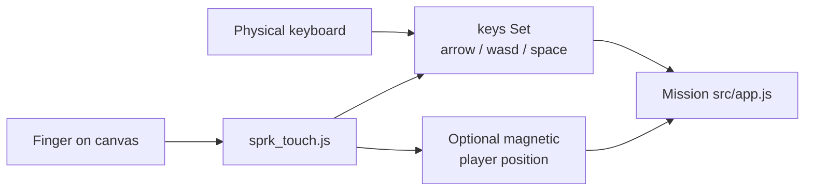

# SPRK Touch Control Guide

This guide explains how SPRK browser missions work on **iPhone, iPad, Chromebook touchscreens, and other pointer devices**, and how that maps to keyboard controls.

Shared implementation:

- `missions/_shared/sprk_touch.js` — pointer handling, multi-touch, magnetic tracking, fullscreen
- `missions/_shared/sprk_touch.css` — touch hints and fullscreen layout

Facilitators hosting a class should also read [SPRK Facilitator Guide](SPRK_Facilitator_Guide.md).


## Table of contents

- [One-Page Touch Cheat Sheet](#one-page-touch-cheat-sheet) [[#One-Page Touch Cheat Sheet]] (obsidian)
- [How Touch Maps To Keyboard](#how-touch-maps-to-keyboard) [[#How Touch Maps To Keyboard]] (obsidian)
- [Generic Mission Integration](#generic-mission-integration) [[#Generic Mission Integration]] (obsidian)
- [Mission Support Matrix](#mission-support-matrix) [[#Mission Support Matrix]] (obsidian)
- [Keyboard Actions Not Yet On Touch](#keyboard-actions-not-yet-on-touch) [[#Keyboard Actions Not Yet On Touch]] (obsidian)
- [Two-Player Keyboard On One Touchscreen](#two-player-keyboard-on-one-touchscreen) [[#Two-Player Keyboard On One Touchscreen]] (obsidian)
- [Two-Player Across Devices (Recommended)](#two-player-across-devices-recommended) [[#Two-Player Across Devices (Recommended)]] (obsidian)
- [Fullscreen On iPhone](#fullscreen-on-iphone) [[#Fullscreen On iPhone]] (obsidian)
- [Facilitator Checklist (Touch Classes)](#facilitator-checklist-touch-classes) [[#Facilitator Checklist (Touch Classes)]] (obsidian)
- [Troubleshooting](#troubleshooting) [[#Troubleshooting]] (obsidian)
- [Related Guides](#related-guides) [[#Related Guides]] (obsidian)

## One-Page Touch Cheat Sheet

| Gesture | Game effect (when enabled) |
| --- | --- |
| **Drag** on play area | Hold movement keys (arrows + WASD) for that direction, or **magnetic** slide on the player |
| **Quick tap** on play area | Same as **Space** (fire, confirm, primary action) |
| **Second finger** down while first holds | **Space** / action (fire without stopping movement) |
| **Fullscreen** button | Toggle expanded play area (works on iPhone; native fullscreen when the browser allows) |
| **Long-press ~1.2s** on play area (phone) | Same fullscreen toggle without triple-tap (avoids iOS system menus) |
| **Triple-tap** play surface | Fullscreen on **desktop only** (disabled on phones — iOS intercepts triple-tap) |
| **On-screen buttons** | Still work (dimension shift, start, quiz next, and so on) |

## How Touch Maps To Keyboard

The touch layer does not replace mission logic. It updates the same `keys` set or direction callbacks that keyboard handlers already use.



## Generic Mission Integration

Add to `index.html`:

```html
<link rel="stylesheet" href="../_shared/sprk_touch.css">
<script src="../_shared/sprk_touch.js"></script>
```

Wrap the canvas in `sprk-play-surface` on the play card, then in `src/app.js`:

```javascript
SPRK_TOUCH.attach({
  target: canvas,
  keys, // same Set used by keydown handlers
  onAction: () => fireOrConfirm(),
  unlockSound: () => SPRK.unlockSound(),
  fullscreenElement: document.querySelector(".sprk-play-surface"),
  magnetic: {
    radius: 72,
    isEnabled: () => gameIsRunning,
    getFocusPoint: () => ({ x: playerScreenX, y: playerScreenY }),
    applyFocusPoint: (x, y) => { /* set player from canvas coords */ },
  },
});
```

For **grid / turn** games (Snake), use `onDirection` instead of `keys`:

```javascript
SPRK_TOUCH.attach({
  target: canvas,
  onDirection: (dx, dy) => setDirection({ x: dx, y: dy }),
  unlockSound: () => SPRK.unlockSound(),
});
```

For **split keyboard** missions (Ping Pong), use `splitZones`:

```javascript
SPRK_TOUCH.attach({
  target: canvas,
  keys,
  splitZones: [
    { movement: { up: ["w"], down: ["s"], left: [], right: [] } },
    { movement: { up: ["arrowup"], down: ["arrowdown"], left: [], right: [] } },
  ],
});
```

## Mission Support Matrix

| Mission | Touch status | Notes |
| --- | --- | --- |
| 01 Reaction Race | Native | Large tap button — already touch-first |
| 02 Snake Game | **Integrated** | Drag for direction; direction pad still available |
| 03 Ping Pong | **Integrated** | Left/right half = W/S vs arrows; one phone can play both sides |
| 04 Flash Cards | Native | Typing / buttons |
| 05 Quiz Room | Native | Forms + facilitator buttons |
| 06 Four Square | Native | Tile buttons |
| 07 Soccer Score | Native | Forms and score buttons |
| 08 Soccer Match | **Keyboard / multi-device** | WASD vs arrows + Z/X turn + Space kick — see below |
| 10 Space Invaders | **Integrated** | Magnetic cannon in 2D/3D rail; buttons for dimension shift |
| XX Template | Link here when you add canvas play | Copy Mission 10 or 02 pattern |

## Keyboard Actions Not Yet On Touch

These still need **physical keyboard** or **on-screen mission buttons**:

| Keys / input | Typical use | Touch today |
| --- | --- | --- |
| **Shift**, **F** | Space Invaders dimension / FPS shift | Use **Dimension Shift** / **FPS Dive** buttons |
| **Q**, **E** | Space Invaders FPS strafe | Not on touch — use buttons or keyboard |
| **Mouse move** | FPS aim in Space Invaders | Not on touch — pointer lock is desktop-only |
| **Z**, **X** | Soccer Match turn | Not on touch |
| **Tab**, **Enter** in forms | Names, quiz answers | OS keyboard when field focused |
| **Facilitator-only** keys | Quiz Room “Next” | Button in UI |

Future work could add on-screen sticks or aim pads; the guide calls out gaps so classes plan devices.

## Two-Player Keyboard On One Touchscreen

Some missions model **two keyboards** on one computer:

| Mission | Keyboard split | One touch screen? |
| --- | --- | --- |
| 03 Ping Pong | W/S vs Up/Down | **Yes** — left/right halves (implemented) |
| 08 Soccer Match | WASD vs arrows (+ Z/X, Space) | **Poor fit** — too many keys per player |

### Soccer Match recommendation

On a **single** phone or tablet:

- Prefer **two devices** on the same facilitator link: one student joins **WASD**, another joins **Arrow**.
- Or project on one screen with **two students on keyboards** at the host laptop.

Call this out in class so students do not expect full 2P soccer on one iPhone.

### Ping Pong recommendation

One phone **can** host both paddles for a demo. For a real match, two devices or keyboards still feel fairer.

## Two-Player Across Devices (Recommended)

This is the main classroom pattern for nP missions:

1. Facilitator shares **one** tunnel or LAN URL ([Facilitator Guide](SPRK_Facilitator_Guide.md)).
2. Each device opens the same link.
3. Each player uses touch or keyboard locally.
4. Backend keeps shared state.

No special touch code is required beyond each client handling its own input.

## Fullscreen On iPhone

iOS often opens **system menus** on triple-tap, so SPRK uses safer options:

| Method | Device |
| --- | --- |
| Tap the **Fullscreen** button | All touch devices (recommended) |
| **Press and hold** the canvas ~1.2 seconds without moving | Phones / tablets |
| **Triple-tap** the canvas | Desktop browsers only |

On iPhone, fullscreen usually means an **expanded play card** (CSS) that fills the screen. That works even when Safari blocks the browser Fullscreen API. Tap **Fullscreen** again to exit.

Mission 10 hides **Dimension Shift** and **FPS Dive** on touch until those modes are reworked. Classic **2D waves** are the classroom path.

## Facilitator Checklist (Touch Classes)

- [ ] Test the class link on a **student phone** before class.
- [ ] Tell students: drag to move, second finger or tap to fire (where applicable).
- [ ] Mention triple-tap fullscreen for small screens.
- [ ] For Soccer Match 2P, assign **two devices** or keyboard players — do not rely on one phone.
- [ ] Keep using **bit.ly** or a stable short link ([Cloud Facilitator Hosting](SPRK_Cloud_Facilitator_Hosting_Guide.md)).

## Troubleshooting

| Issue | Try |
| --- | --- |
| Page scrolls instead of moving | Canvas should have `touch-action: none` via `sprk_touch.css` |
| Fire does not work | Use second finger while dragging, or quick tap without dragging |
| Two scoreboards | Everyone must use the **same** facilitator URL |
| FPS mode awkward on phone | Stay in 2D/rail or use dimension buttons; mouse-aim needs keyboard/desktop |
| Fullscreen does not open | Browser may block — use Safari/Chrome, triple-tap again |

## Related Guides

- [SPRK Facilitator Guide](SPRK_Facilitator_Guide.md)
- [SPRK Browser Mission Foundation Guide](SPRK_Browser_Mission_Foundation_Guide.md)
- [SPRK Cloud Facilitator Hosting Guide](SPRK_Cloud_Facilitator_Hosting_Guide.md)
