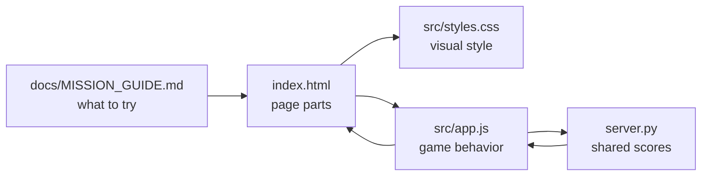
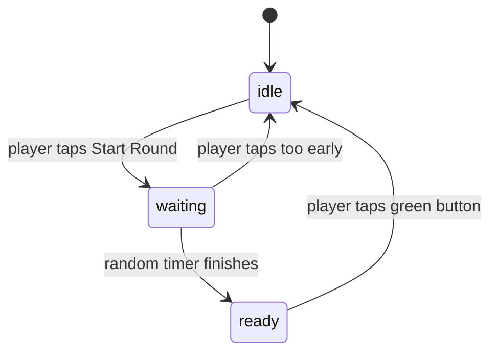

# ReactionRace Code Walkthrough
This guide explains how the files and functions work together.

## File Map
```text
01-ReactionRace-nP/
  index.html
    The page structure. It names the parts students can see.

  src/styles.css
    The visual design. It controls color, spacing, layout, and phone/tablet sizing.

  src/app.js
    The frontend game behavior. It starts rounds, waits, records taps, and sends scores to server.py.

  server.py
    The backend. It serves the browser files and stores one shared classroom scoreboard.

  docs/MISSION_GUIDE.md
    The student mission instructions.
```

## File Interaction Diagram


Plain version:

```text
index.html gives the app its parts
  -> styles.css makes those parts look good
  -> app.js makes those parts react to taps
  -> server.py saves the shared scores
  -> the browser shows the result
```

## Game State Flow
The game uses `roundState` to remember what is happening.



Plain version:

```text
idle
  The game is ready to start.

waiting
  The player must wait. Tapping now is too early.

ready
  The button is green. The player should tap now.

idle
  The score is saved and the next round can start.
```

## Function Guide
| Function | Job | Student-Friendly Meaning |
| --- | --- | --- |
| `setMessage(status, message)` | Updates status text. | Tell the player what is happening. |
| `setButton(label, state)` | Changes button text and color state. | Make the big button match the game moment. |
| `updateBestTime()` | Finds the fastest score. | Show who is winning. |
| `renderScores()` | Rebuilds the scoreboard. | Redraw the class results. |
| `loadSharedScores()` | Gets scores from `server.py`. | Ask the classroom backend who is winning. |
| `saveSharedScore(score)` | Sends one score to `server.py`. | Add this player's tap to the classroom scoreboard. |
| `clearSharedScores()` | Clears scores through `server.py`. | Reset the shared scoreboard for the class. |
| `window.setInterval(...)` | Refreshes scores every few seconds. | Let each device see scores from other devices. |
| `startRound()` | Starts a new round with a random wait. | Begin the challenge. |
| `recordTap()` | Saves a successful reaction time. | Add one score. |
| `handleEarlyTap()` | Cancels a too-early tap. | Reset after jumping early. |

## Main Click Flow
This is the most important part of `src/app.js`.

```text
Player taps the big button
  |
  v
Is roundState "idle"?
  yes -> startRound()
  no
  |
  v
Is roundState "waiting"?
  yes -> handleEarlyTap()
  no
  |
  v
Is roundState "ready"?
  yes -> recordTap()
           |
           v
         saveSharedScore()
           |
           v
         server.py updates shared scoreboard
```

## First Safe Changes
Try these before adding new features:

1. Change `let playerName = "Maya-SPRK";` in `src/app.js`.
2. Change `setButton("Tap Now!", "ready");` in `src/app.js`.
3. Change `--go: #1fc76a;` in `src/styles.css`.
4. Change the headline text in `index.html`.

## Learning Insight
This mission teaches a common app pattern:

```text
User action
  -> JavaScript changes data
  -> JavaScript talks to the backend
  -> Backend stores shared data
  -> JavaScript updates the page
  -> CSS makes the result visible
```

That same pattern appears in games, flash cards, dashboards, and many phone-friendly web apps.
