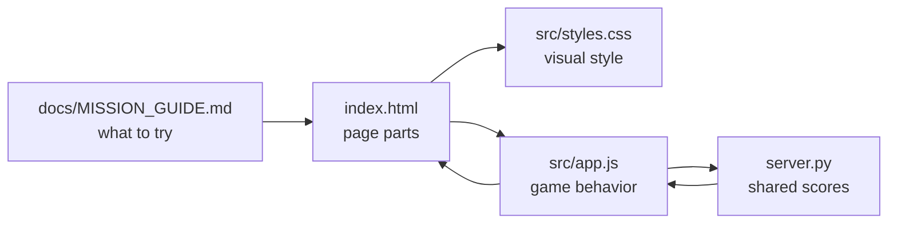
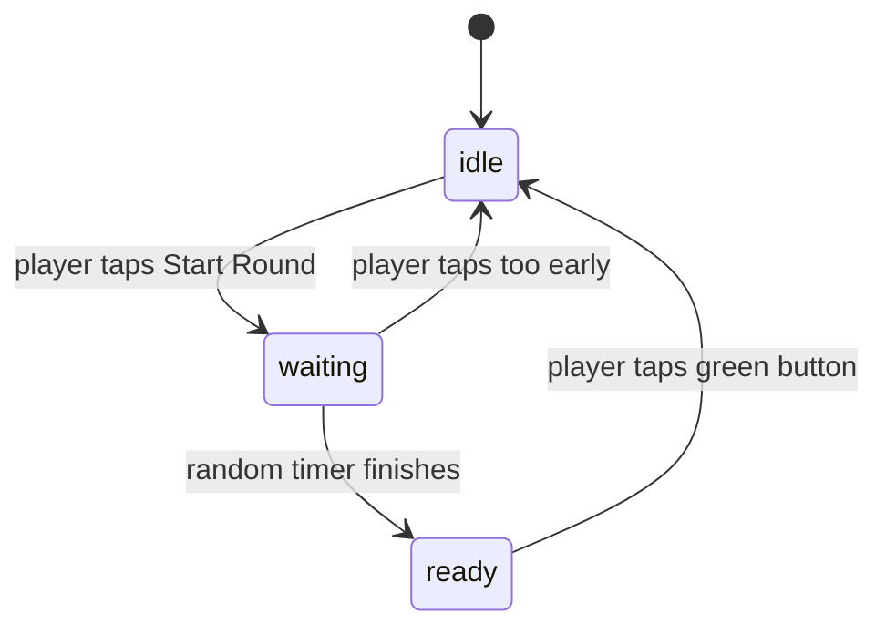

# ReactionRace Code Walkthrough
This guide explains how the files and functions work together.

## File Map
```text
01-ReactionRace-nP/
  index.html
    The page structure. It names the compact top band, player controls, sound dropdown, game button, scoreboard, X-Ray Vision panel, and challenge cards.

  src/styles.css
    The visual design. It controls color, spacing, layout, and phone/tablet sizing.

  src/app.js
    The frontend game behavior. It starts rounds, waits, records taps, and sends scores to server.py.

  server.py
    The backend. It serves the browser files, stores one shared classroom scoreboard, and stores recent backend events for X-Ray Vision.
    It also checks whether port 8000 is already busy before it starts.

  docs/MISSION_GUIDE.md
    The student mission instructions.
```

## File Interaction Diagram


Plain version:

```text
index.html gives the app its parts
  -> styles.css makes those parts look good
  -> app.js makes those parts react to taps
  -> server.py saves the shared scores
  -> the browser shows the result
```

## Screen Layout
The app uses one compact game screen so students can play without hunting around the page.

```text
mission-band
  -> left: mission name and short instruction
  -> right: player name controls

game-board
  -> left: race-card with the big button
  -> right: shared scoreboard or X-Ray Vision

student-notes
  -> starter changes
  -> logic challenges
  -> level-up challenges
```

## Game State Flow
The game uses `roundState` to remember what is happening.



Plain version:

```text
idle
  The game is ready to start.

waiting
  The player must wait. Tapping now is too early.

ready
  The button is green. The player should tap now.

idle
  The score is saved and the next round can start.
```

## Function Guide
| Function | Job | Student-Friendly Meaning |
| --- | --- | --- |
| `setMessage(status, message)` | Updates status text. | Tell the player what is happening. |
| `setButton(label, state)` | Changes button text and color state. | Make the big button match the game moment. |
| `updateBestTime()` | Finds the fastest score. | Show who is winning. |
| `renderScores()` | Rebuilds the scoreboard. | Redraw the class results. |
| `loadSharedScores()` | Gets scores from `server.py`. | Ask the classroom backend who is winning. |
| `saveSharedScore(score)` | Sends one score to `server.py`. | Add this player's tap to the classroom scoreboard. |
| `clearSharedScores()` | Clears scores through `server.py`. | Reset the shared scoreboard for the class. |
| `unlockSound()` | Starts browser sound after a click. | Browsers allow sound after the user interacts. |
| `playTone(...)` | Creates one short sound. | Web Audio can make sounds without sound files. |
| `playPlayerSound(score)` | Plays the player's chosen sound. | Score data can control sound. |
| `showPanel(panelName)` | Switches tabs. | One screen area can show different panels. |
| `loadBackendEvents()` | Gets X-Ray events from `server.py`. | The frontend can show backend activity. |
| `window.setInterval(...)` | Refreshes scores every few seconds. | Let each device see scores from other devices. |
| `startRound()` | Starts a new round with a random wait. | Begin the challenge. |
| `recordTap()` | Saves a successful reaction time. | Add one score. |
| `handleEarlyTap()` | Cancels a too-early tap. | Reset after jumping early. |

## Main Click Flow
This is the most important part of `src/app.js`.

```text
Player taps the big button
  |
  v
Is roundState "idle"?
  yes -> startRound()
  no
  |
  v
Is roundState "waiting"?
  yes -> handleEarlyTap()
  no
  |
  v
Is roundState "ready"?
  yes -> recordTap()
           |
           v
         saveSharedScore()
           |
           v
         server.py updates shared scoreboard
```

## First Safe Changes
Try these before adding new features:

1. Change `let playerName = "Maya-SPRK";` in `src/app.js`.
2. Change `setButton("Tap Now!", "ready");` in `src/app.js`.
3. Change `--go: #1fc76a;` in `src/styles.css`.
4. Change the compact heading text in `index.html`.

## Challenge Tiers
The page shows three challenge groups:

| Tier | Meaning | Where To Start |
| --- | --- | --- |
| Starter changes | Change text, colors, or default names. | `index.html`, `src/styles.css`, `src/app.js` constants. |
| Logic challenges | Change timing, names, or score limits. | `startRound()`, `saveNameButton` handler, `MAX_SCORES`. |
| Level-up challenges | Change multiple files and data flow. | `index.html`, `src/app.js`, and `server.py` together. |

## Sound And Animation Flow
Player sounds use the browser's Web Audio API.

```text
Student picks sound
  -> app.js saves sound with score
  -> server.py stores sound
  -> scoreboard refresh receives sound
  -> playPlayerSound(score) plays the sound
```

Scoreboard animations use CSS classes.

```text
renderScores()
  -> compares previous ranks to new ranks
  -> adds score-new for a new score
  -> adds score-up for a score that moved up
  -> adds score-leader for first place
  -> styles.css animates those classes
```

Students can add other animations by following the same pattern:

1. Create a CSS class with an `animation`.
2. Add a `@keyframes` block.
3. Add that class from `renderScores()` when the right condition happens.

## X-Ray Vision Flow
X-Ray Vision shows backend events in the frontend.

```text
server.py does backend work
  -> log_event(kind, message) prints to the terminal
  -> log_event(kind, message) also saves the event
  -> app.js calls /api/events
  -> X-Ray Vision displays the event
```

This is a teaching pattern: terminal output is useful, but a student-facing debug panel can make the backend visible without leaving the app.

## Learning Insight
This mission teaches a common app pattern:

```text
User action
  -> JavaScript changes data
  -> JavaScript talks to the backend
  -> Backend stores shared data
  -> JavaScript updates the page
  -> CSS makes the result visible
```

That same pattern appears in games, flash cards, dashboards, and many phone-friendly web apps.
