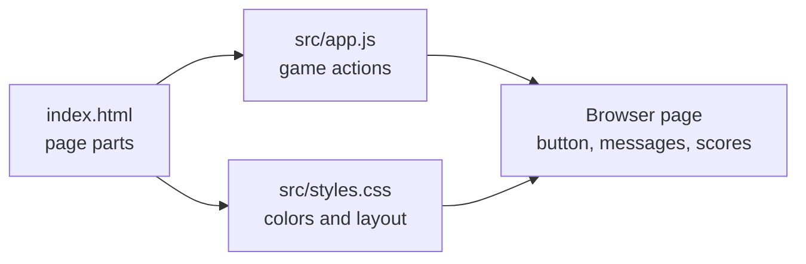
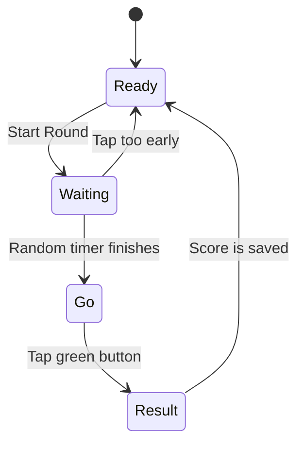

# Mission 01: ReactionRace
ReactionRace is the first recommended classroom mission because everyone can join quickly from a browser.

## Mission Goal
Build a whole-class reaction game where students join from phones, tablets, Chromebooks, or laptops and compete on a live leaderboard.

## Open The App
Open:

```text
missions/01-ReactionRace-nP/index.html
```

In Codespaces, right-click `index.html` and use a preview option if one is available. If preview is not available, start with the normal GitHub file view to inspect the code, then use the next browser-preview setup provided by SPRKTeacher or SPRKAdmin.

## Entry Point
Start with `index.html`.

That file is the front door for this mission. The browser opens `index.html`, then `index.html` loads the other files.

```text
index.html
  |
  |-- loads src/styles.css
  |
  |-- loads src/app.js
```

Simple meaning:

- `index.html` decides what is on the page.
- `src/styles.css` decides how the page looks.
- `src/app.js` decides how the game behaves.

## How The Files Work Together


Plain version:

```text
index.html creates the game parts
  -> styles.css makes the game readable and touch-friendly
  -> app.js listens for taps and updates the score
  -> the browser shows the result
```

## What Each File Does
| File | Student Meaning | Good First Change |
| --- | --- | --- |
| `index.html` | The page skeleton. It has the title, name box, button, scoreboard, and notes. | Change a heading or instruction sentence. |
| `src/styles.css` | The style file. It controls colors, spacing, button size, and phone/tablet layout. | Change a color variable like `--go`. |
| `src/app.js` | The game brain. It starts rounds, waits, checks taps, and updates scores. | Change button text or the default player name. |
| `docs/CODE_WALKTHROUGH.md` | The deeper explanation. It has function notes and diagrams. | Read this when you want to understand the code flow. |

## Game Flow


Plain version:

```text
Ready
  Student taps Start Round

Waiting
  Student must wait and not tap early

Go
  Button turns green

Result
  App saves the reaction time

Ready
  Student can start again
```

## Mode
`nP`: many players.

## Play It
Join the facilitator's game link and try one reaction round.

Solo test:

1. Type your player name.
2. Select `Use Name`.
3. Select `Start Round`.
4. Wait for the button to turn green.
5. Tap as fast as you can.
6. Compare the score with another player.

## Change It
Change one visible setting, such as the round label, button text, reaction message, or leaderboard title.

Good first files to inspect:

- `index.html`: page structure.
- `src/app.js`: game behavior.
- `src/styles.css`: colors, spacing, and layout.
- `docs/CODE_WALKTHROUGH.md`: diagrams and function explanations.

## Show It
Run the changed version and show that the browser display changed.

## Level It Up
Add player names, teams, score history, or a new round type.

## Branch Reminder
Create your branch before editing files.

Guide: [SPRK Git Repository User Guide](../../../docs/SPRK_Git_Repository_UserGuide.md#create-your-branch)
