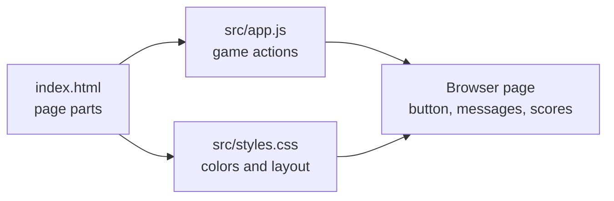
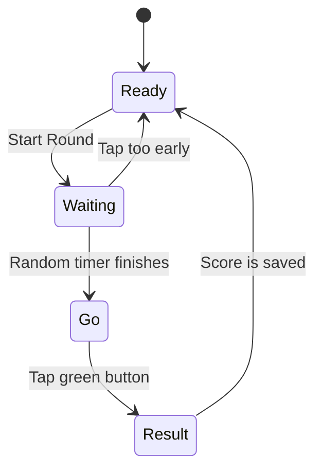

# Mission 01: ReactionRace
ReactionRace is the first recommended classroom mission because everyone can join quickly from a browser.

## Mission Goal
Build a whole-class reaction game where students join from phones, tablets, Chromebooks, or laptops and compete on a live leaderboard.

## Open The App
Open:

```text
missions/01-ReactionRace-nP/index.html
```

In Codespaces, right-click `index.html` and use a preview option if one is available. If preview is not available, start with the normal GitHub file view to inspect the code, then use the next browser-preview setup provided by SPRKTeacher or SPRKAdmin.

## How To Run
ReactionRace is currently a browser app. That means the first version runs with only HTML, CSS, and JavaScript.

### Run From Codespaces
Use this path on iPad, Chromebook, or any browser device that can open Codespaces.

1. Open `SPRK-Hello-Repo` in Codespaces.
2. Open the terminal.
3. Run:

```bash
cd missions/01-ReactionRace-nP
python -m http.server 8000
```

4. Open the `Ports` tab.
5. Open the forwarded port for `8000`.
6. The browser should show ReactionRace.

### Run From VS Code Desktop
Use this path on a laptop with the repository cloned locally.

1. Open the repository in VS Code.
2. Open the terminal.
3. Run:

```bash
cd missions/01-ReactionRace-nP
python -m http.server 8000
```

4. Open:

```text
http://localhost:8000
```

### Run From A Classroom Host Laptop
Use this path when one laptop hosts the app and other devices join from a browser.

1. Connect the host laptop and student devices to the same network.
2. On the host laptop, run:

```bash
cd missions/01-ReactionRace-nP
python -m http.server 8000 --bind 0.0.0.0
```

3. Find the host laptop IP address.
4. Student devices open:

```text
http://<host-laptop-ip>:8000
```

Example:

```text
http://192.168.1.25:8000
```

If the page does not open from another device, the network or firewall may be blocking device-to-device traffic.

## Entry Point
Start with `index.html`.

That file is the front door for this mission. The browser opens `index.html`, then `index.html` loads the other files.

```text
index.html
  |
  |-- loads src/styles.css
  |
  |-- loads src/app.js
```

Simple meaning:

- `index.html` decides what is on the page.
- `src/styles.css` decides how the page looks.
- `src/app.js` decides how the game behaves.

## How The Files Work Together


Plain version:

```text
index.html creates the game parts
  -> styles.css makes the game readable and touch-friendly
  -> app.js listens for taps and updates the score
  -> the browser shows the result
```

## What Each File Does
| File | Student Meaning | Good First Change |
| --- | --- | --- |
| `index.html` | The page skeleton. It has the title, name box, button, scoreboard, and notes. | Change a heading or instruction sentence. |
| `src/styles.css` | The style file. It controls colors, spacing, button size, and phone/tablet layout. | Change a color variable like `--go`. |
| `src/app.js` | The game brain. It starts rounds, waits, checks taps, and updates scores. | Change button text or the default player name. |
| `docs/CODE_WALKTHROUGH.md` | The deeper explanation. It has function notes and diagrams. | Read this when you want to understand the code flow. |

## Game Flow


Plain version:

```text
Ready
  Student taps Start Round

Waiting
  Student must wait and not tap early

Go
  Button turns green

Result
  App saves the reaction time

Ready
  Student can start again
```

## Mode
`nP`: many players.

## Play It
Join the facilitator's game link and try one reaction round.

### Solo Test
Use this when one person is testing on one device.

1. Type your player name.
2. Select `Use Name`.
3. Select `Start Round`.
4. Wait for the button to turn green.
5. Tap as fast as you can.
6. Try again and beat your own best score.

### Group Test With Different Devices
Use this when a facilitator shares the app link with multiple students.

1. Facilitator runs the app from Codespaces or a host laptop.
2. Facilitator shares the app link.
3. Each student opens the link on a phone, tablet, Chromebook, or laptop.
4. Each student types their own player name.
5. Each student runs one or more reaction rounds.
6. Students compare scores out loud or from the visible scoreboard on their own device.

Important current limit:

Each browser keeps its own local scoreboard in this first version. If three students open the app on three devices, each device has its own scoreboard.

The shared classroom scoreboard comes in the backend version.

## Frontend And Backend
This first version is frontend-only.

```text
Browser
  |
  |-- index.html
  |-- src/styles.css
  |-- src/app.js
  |
  v
Local scoreboard on that device
```

What the frontend does now:

- Shows the page.
- Handles taps.
- Measures reaction time.
- Stores scores in the current browser page.

The backend version will add a shared server:

```text
Student device browser
  |
  v
Backend server on Codespaces or host laptop
  |
  v
Shared classroom scoreboard
```

What the backend will do later:

- Receive scores from many devices.
- Store one shared scoreboard.
- Send the updated scoreboard back to every player.
- Let phones, tablets, Chromebooks, and laptops play together in the same classroom round.

## Change It
Change one visible setting, such as the round label, button text, reaction message, or leaderboard title.

Good first files to inspect:

- `index.html`: page structure.
- `src/app.js`: game behavior.
- `src/styles.css`: colors, spacing, and layout.
- `docs/CODE_WALKTHROUGH.md`: diagrams and function explanations.

## Show It
Run the changed version and show that the browser display changed.

## Level It Up
Add player names, teams, score history, or a new round type.

## Branch Reminder
Create your branch before editing files.

Guide: [SPRK Git Repository User Guide](../../../docs/SPRK_Git_Repository_UserGuide.md#create-your-branch)
