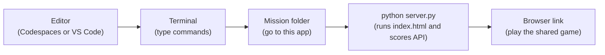
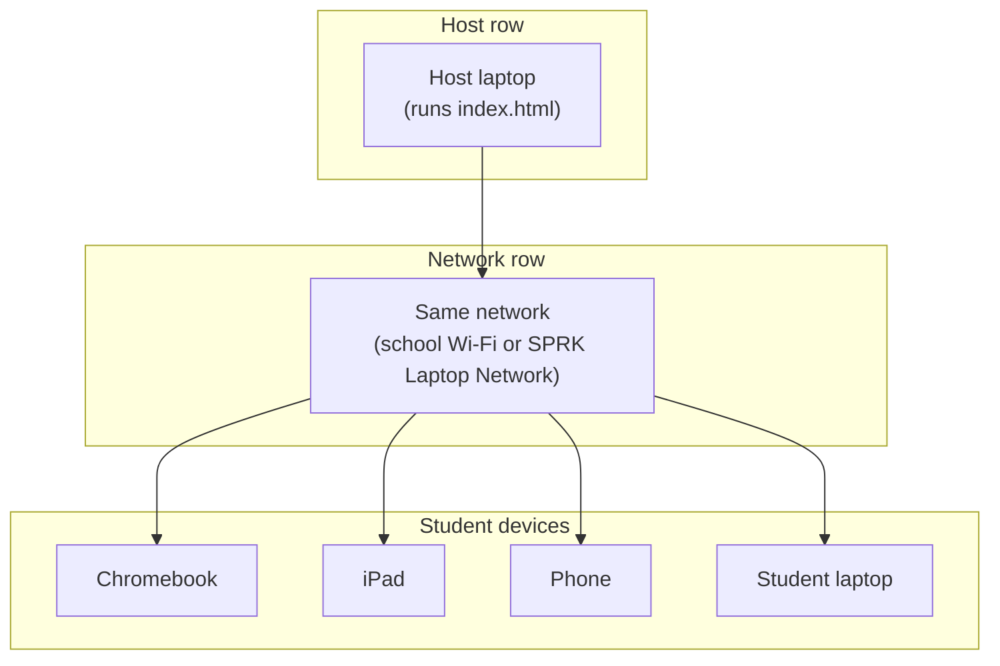
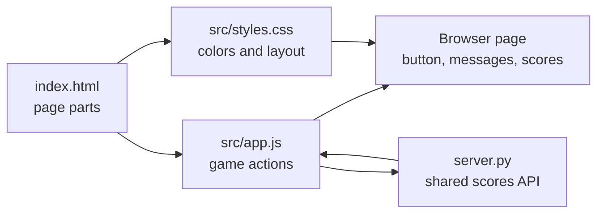
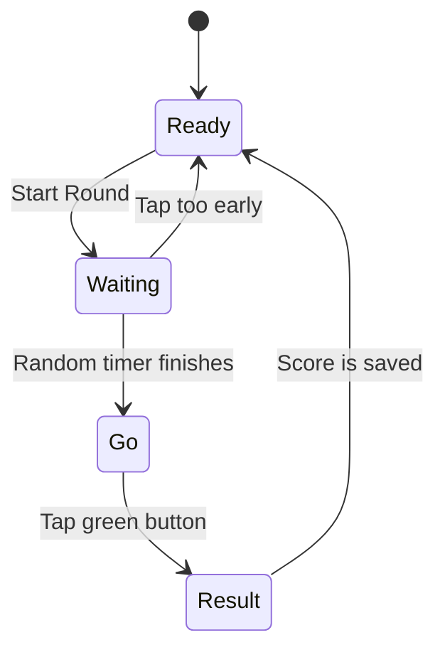
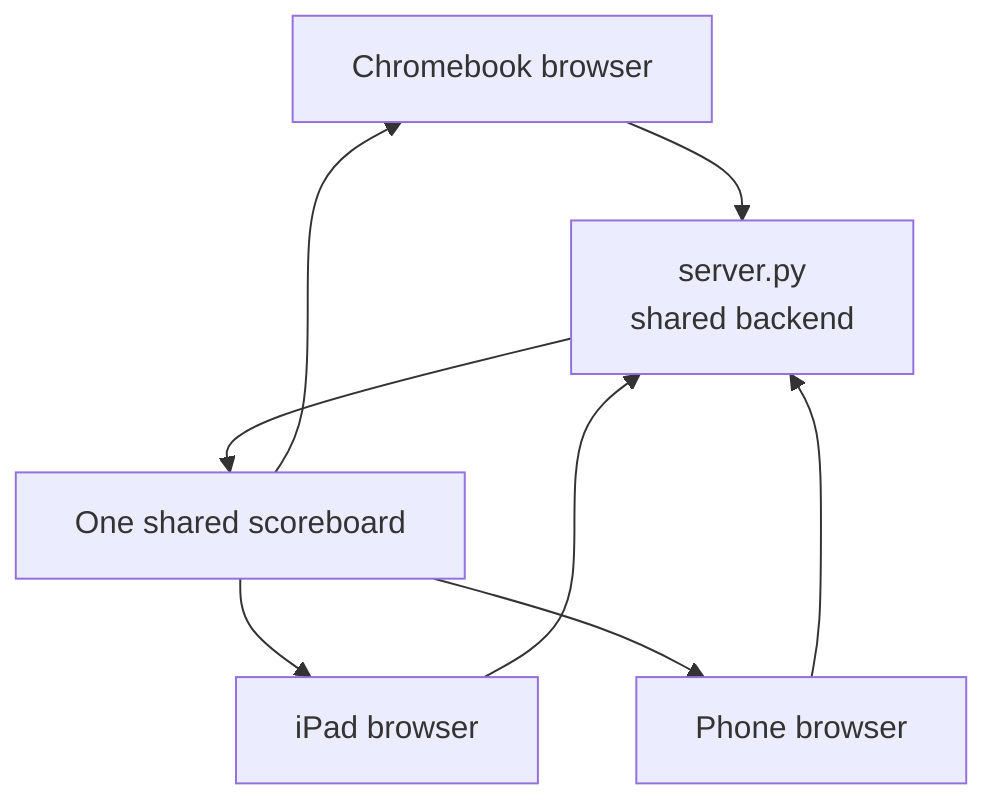
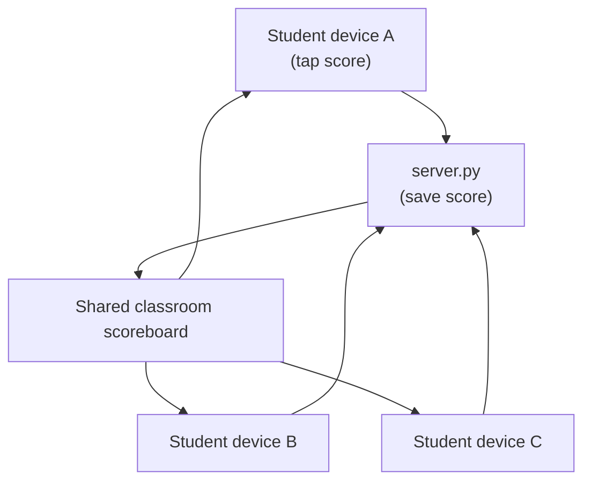

# Mission 01: ReactionRace
ReactionRace is the first recommended classroom mission because everyone can join quickly from a browser.

## Start Here
If you are new, follow these in order:

1. [Run the app](#how-to-run) [[#How To Run]] (obsidian).
2. [Play one solo round](#play-it) [[#Play It]] (obsidian).
3. [Understand the entry point](#entry-point) [[#Entry Point]] (obsidian).
4. [Open the code files](#code-files) [[#Code Files]] (obsidian).
5. [Make one small change](#change-it) [[#Change It]] (obsidian).
6. [Read the deeper walkthrough](CODE_WALKTHROUGH.md) when you want the full code explanation.

## Mission Navigation
| Need | Go Here |
| --- | --- |
| I want to run it | [How To Run](#how-to-run) [[#How To Run]] (obsidian) |
| I want to play it | [Play It](#play-it) [[#Play It]] (obsidian) |
| I want to know where the app starts | [Entry Point](#entry-point) [[#Entry Point]] (obsidian) |
| I want to know which file to open | [Code Files](#code-files) [[#Code Files]] (obsidian) |
| I want diagrams and function details | [CODE_WALKTHROUGH.md](CODE_WALKTHROUGH.md) |
| I want to understand sounds and animations | [Sounds Animations And X-Ray Vision](#sounds-animations-and-x-ray-vision) [[#Sounds Animations And X-Ray Vision]] (obsidian) |
| I need to create my branch first | [SPRK Git Repository User Guide](../../../docs/SPRK_Git_Repository_UserGuide.md#create-your-branch) [[docs/SPRK_Git_Repository_UserGuide#Create Your Branch]] (obsidian) |

## Standard SPRK Guidance
This working repository carries local copies of the shared SPRK guides in `../../../docs/`.

The public source for shared SPRK onboarding and governance is:

```text
https://github.com/Mr-PI-Bala/SPRK-Welcome
```

Students can always read `SPRK-Welcome` because it is public. Working repositories like this one may be private, so they keep local guide copies after access is approved.

Shared browser-mission foundation:

- [../../../docs/SPRK_Browser_Mission_Foundation_Guide.md](../../../docs/SPRK_Browser_Mission_Foundation_Guide.md)

## Mission Goal
Build a whole-class reaction game where students join from phones, tablets, Chromebooks, or laptops and compete on a live leaderboard.

## Open The App
The recommended classroom version uses `server.py`.

Open the app through the browser link created in [How To Run](#how-to-run) [[#How To Run]] (obsidian).

Code starting point:

```text
missions/01-ReactionRace-nP/index.html
```

`index.html` is still the page, but `server.py` is what makes the shared scoreboard work across devices.

## How To Run
ReactionRace is a browser app with a tiny Python backend.

The frontend is what students see in the browser. The backend is `server.py`, and it keeps one shared classroom scoreboard.



Plain version:

```text
Editor (Codespaces or VS Code)
  -> Terminal (type commands)
  -> Mission folder (go to this app)
  -> python server.py (runs index.html and the shared scores API)
  -> Browser link (play the shared game)
```

### Run From Codespaces
Use this path on iPad, Chromebook, or any browser device that can open Codespaces.

1. Open `SPRK-Hello-Repo` in Codespaces.
2. Open the terminal.
3. Run:

```bash
cd missions/01-ReactionRace-nP
python server.py
```

4. Open the `Ports` tab.
5. Open the forwarded port for `8000`.
6. The browser should show ReactionRace.

If port `8000` is already being used, `server.py` will warn you. When it can identify the old process, it asks before stopping it. This keeps old servers from running in the background by accident.

The Codespaces link will look something like:

```text
https://<your-codespace-name>-8000.app.github.dev
```

That link means:

- `8000` is the port where `server.py` is running.
- `app.github.dev` is GitHub's browser access to your Codespace.
- Opening the link shows `index.html`.
- Scores go through `/api/scores`, which is handled by `server.py`.

### Run From VS Code Desktop
Use this path on a laptop with the repository cloned locally.

1. Open the repository in VS Code.
2. Open the terminal.
3. Run:

```bash
cd missions/01-ReactionRace-nP
python server.py
```

4. Open:

```text
http://localhost:8000
```

That link means:

- `localhost` is your own laptop.
- `8000` is the port where `server.py` is running.
- Opening the link shows `index.html`.
- Scores go through `/api/scores`, which is handled by `server.py`.

## Language Crosswalk In This Mission
Use the repo-wide guide: [../../../docs/SPRK_Language_Crosswalk.md](../../../docs/SPRK_Language_Crosswalk.md)

ReactionRace is a strong example of:

- state machines: `idle -> waiting -> ready -> idle`
- callbacks and timers: button clicks plus delayed round timing
- string interpolation: player-facing status and scoreboard text
- frontend/backend API flow: browser calls to `/api/scores` and `/api/events`

### Run From A Classroom Host Laptop
Use this path when one laptop hosts the app and other devices join from a browser.



Plain version:

```text
Host laptop (runs index.html)
  -> same network (school Wi-Fi or SPRK Laptop Network)
     -> Chromebook opens http://<host-laptop-ip>:8000
     -> iPad opens http://<host-laptop-ip>:8000
     -> phone opens http://<host-laptop-ip>:8000
     -> student laptop opens http://<host-laptop-ip>:8000
```

1. Connect the host laptop and student devices to the same network.
2. On the host laptop, run:

```bash
cd missions/01-ReactionRace-nP
python server.py
```

3. Find the host laptop IP address.
4. Student devices open:

```text
http://<host-laptop-ip>:8000
```

Example:

```text
http://192.168.1.25:8000
```

That link means:

- `192.168.1.25` is an example host laptop IP address.
- `8000` is the port where `server.py` is running.
- Every student device must be on the same network to open this link.
- Everyone who opens the same host link uses the same shared scoreboard.

If the page does not open from another device, the network or firewall may be blocking device-to-device traffic.

## Entry Point
Start with `index.html`.

That file is the front door for this mission. The browser opens `index.html`, then `index.html` loads the other files.

```text
index.html
  |
  |-- loads src/styles.css
  |
  |-- loads src/app.js
  |
  |-- talks to server.py through /api/scores
```

Simple meaning:

- `index.html` decides what is on the page.
- `src/styles.css` decides how the page looks.
- `src/app.js` decides how the game behaves.
- `server.py` stores the shared classroom scoreboard.

## Code Files
Open these files from the mission folder:

| File | Link | What To Look For |
| --- | --- | --- |
| Page structure | [index.html](../index.html) | The title, player name input, big button, scoreboard, and student notes. |
| Game behavior | [src/app.js](../src/app.js) | Functions such as `startRound()`, `recordTap()`, and `handleEarlyTap()`. |
| Visual design | [src/styles.css](../src/styles.css) | Color variables, button size, layout, and phone/tablet rules. |
| Shared backend | [server.py](../server.py) | The API that stores and returns the classroom scoreboard. |
| Deep explanation | [CODE_WALKTHROUGH.md](CODE_WALKTHROUGH.md) | Diagrams, function table, and the main click flow. |

Recommended first code reading path:

```text
index.html
  -> find the big button
  -> src/app.js
  -> find what happens when the button is clicked
  -> src/styles.css
  -> find the button colors
```

## How The Files Work Together


Plain version:

```text
index.html creates the game parts
  -> styles.css makes the game readable and touch-friendly
  -> app.js listens for taps
  -> server.py stores the shared classroom score
  -> app.js redraws the score
  -> the browser shows the result
```

## What Each File Does
| File | Student Meaning | Good First Change |
| --- | --- | --- |
| `index.html` | The page skeleton. It has the title, name box, button, scoreboard, and notes. | Change a heading or instruction sentence. |
| `src/styles.css` | The style file. It controls colors, spacing, button size, and phone/tablet layout. | Change a color variable like `--go`. |
| `src/app.js` | The frontend game brain. It starts rounds, waits, checks taps, and asks the backend to save scores. | Change button text or the default player name. |
| `server.py` | The backend. It serves the page files and stores one shared classroom scoreboard. | Change `MAX_SCORES` after you understand the flow. |
| `docs/CODE_WALKTHROUGH.md` | The deeper explanation. It has function notes and diagrams. | Read this when you want to understand the code flow. |

## Game Flow


Plain version:

```text
Ready
  Student taps Start Round

Waiting
  Student must wait and not tap early

Go
  Button turns green

Result
  App saves the reaction time

Ready
  Student can start again
```

## Mode
`nP`: many players.

## Play It
Join the facilitator's game link and try one reaction round.

What you should see:

```text
Top band
  Mission name on the left
  Player name and sound choice on the right

Main game area
  Big reaction button on the left
  Shared scoreboard or X-Ray Vision on the right

Bottom area
  Three challenge groups with hints
```

The top band should stay small. The button and scoreboard should be visible together on normal laptop, Chromebook, and tablet screens.

### Solo Test
Use this when one person is testing on one device.

1. Type your player name.
2. Pick your sound.
3. Select `Use Name`.
4. Select `Start Round`.
5. Wait for the button to turn green.
6. Tap as fast as you can.
7. Watch the scoreboard animate when scores are added or rankings change.
8. Open `X-Ray Vision` to see backend events coming from `server.py`.

### Group Test With Different Devices
Use this when a facilitator shares the app link with multiple students.

1. Facilitator runs the app from Codespaces or a host laptop.
2. Facilitator shares the app link.
3. Each student opens the link on a phone, tablet, Chromebook, or laptop.
4. Each student types their own player name.
5. Each student picks a sound.
6. Each student runs one or more reaction rounds.
7. Students compare scores from the shared scoreboard.
8. Students open `X-Ray Vision` to see backend events such as score saves and scoreboard clears.

Important current limit:

Everyone must use the same backend link to share scores.

If one student opens one Codespaces link and another student opens a different Codespaces link, those are different backends and the scores will not combine.

## Frontend And Backend
This mission now has both a frontend and a backend.



Plain version:

```text
Chromebook, iPad, phone, or laptop browser
  -> same server.py backend link
  -> one shared scoreboard
  -> updated scores show on each browser
```

What the frontend does:

- Shows the page.
- Handles taps.
- Measures reaction time.
- Sends scores to the backend.
- Redraws the scoreboard it gets back from the backend.

What the backend does:

- Serves `index.html`, `src/styles.css`, and `src/app.js`.
- Receives scores at `/api/scores`.
- Receives backend event requests at `/api/events`.
- Stores one shared scoreboard while `server.py` is running.
- Stores recent backend events for the X-Ray Vision panel.
- Sends updated scores back to every browser that asks for them.
- The browser asks for updated scores every few seconds so other players appear without a manual reload.

Shared-score flow:



Plain version:

```text
Student device browser
  |
  v
Backend server on Codespaces or host laptop
  |
  v
Shared classroom scoreboard
```

## Sounds Animations And X-Ray Vision
ReactionRace now teaches three extra app ideas:

| Feature | Where To Look | What It Teaches |
| --- | --- | --- |
| Player sounds | [index.html](../index.html), [src/app.js](../src/app.js) | A dropdown can control sound behavior in JavaScript. |
| Score animations | [src/styles.css](../src/styles.css), [src/app.js](../src/app.js) | CSS classes can animate new scores and rank changes. |
| X-Ray Vision | [server.py](../server.py), [src/app.js](../src/app.js) | Backend events can be shown inside the frontend so students can see what the server is doing. |

Sound flow:

```text
Student picks a sound
  -> app.js sends the sound with the score
  -> server.py stores it
  -> app.js plays that sound when the score appears or moves up
```

Animation flow:

```text
app.js compares old scoreboard order to new scoreboard order
  -> new score gets score-new
  -> score that moves up gets score-up
  -> first-place score gets score-leader
  -> styles.css animates those classes
```

X-Ray Vision flow:

```text
server.py prints backend events
  -> server.py also stores those events
  -> app.js asks /api/events every few seconds
  -> X-Ray Vision tab shows the backend events
```

## Change It
Start with one small change. Then try a logic challenge after the first change works.

### Starter Changes
These are safe first edits because they mostly change words or colors.

| Challenge | Hint |
| --- | --- |
| Change the button text. | In [src/app.js](../src/app.js), look for `setButton(label, state)`, then find the `"Tap Now!"` call inside `startRound()`. |
| Change the colors. | In [src/styles.css](../src/styles.css), look near the top for color variables like `--go`, `--wait`, and `--accent`. |
| Change the default player name. | In [src/app.js](../src/app.js), look for `let playerName = "Maya-SPRK";`. |
| Change a player sound. | In [index.html](../index.html), look for `soundChoice`; in [src/app.js](../src/app.js), look for `playPlayerSound(score)`. |

### Logic Challenges
These change what the app does, not only how it looks.

| Challenge | Hint |
| --- | --- |
| Make the wait shorter or longer. | In `startRound()`, change the random `delay` formula. |
| Change what counts as a safe player name. | In the `saveNameButton` click handler, change the fallback name or add a minimum length check. |
| Show only the top 10 scores. | In [server.py](../server.py), change `MAX_SCORES`; in `renderScores()`, look at how the score list is drawn. |
| Change when a sound plays. | In `renderScores()`, compare the old rank to the new rank before calling `playPlayerSound(score)`. |

### Level-Up Challenges
These require changing more than one file.

| Challenge | Hint |
| --- | --- |
| Add a team name beside each player. | Add a new input in [index.html](../index.html), read it in [src/app.js](../src/app.js), then include it in the score sent to [server.py](../server.py). |
| Penalize early taps instead of just resetting. | Change `handleEarlyTap()` so it sends a slow score or shows a strike count. |
| Add a classroom round reset message. | After `clearSharedScores()`, update both `setMessage(...)` and `setScoreboardStatus(...)`. |
| Add a new scoreboard animation. | Create a new CSS class in [src/styles.css](../src/styles.css), then add it in `renderScores()` when a score moves up. |

Good files to inspect:

- [index.html](../index.html): page structure.
- [src/app.js](../src/app.js): game behavior.
- [src/styles.css](../src/styles.css): colors, spacing, and layout.
- [server.py](../server.py): shared classroom scoreboard backend.
- [CODE_WALKTHROUGH.md](CODE_WALKTHROUGH.md): diagrams and function explanations.

## Show It
Run the changed version and show that the browser display changed.

## Level It Up
Add player names, teams, score history, or a new round type.

## Branch Reminder
Create your branch before editing files.

Guide: [SPRK Git Repository User Guide](../../../docs/SPRK_Git_Repository_UserGuide.md#create-your-branch) [[docs/SPRK_Git_Repository_UserGuide#Create Your Branch]] (obsidian)
