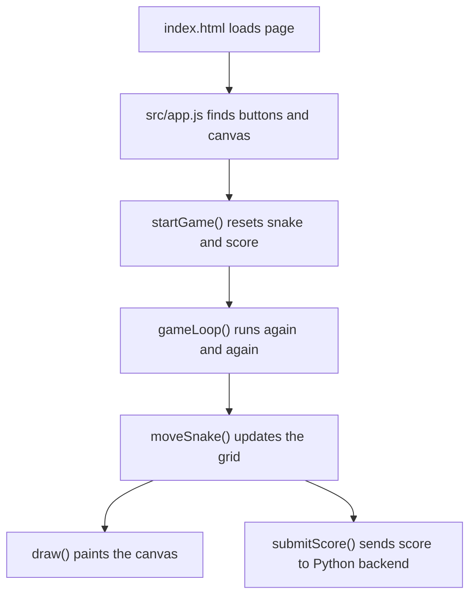

# SnakeGame Code Walkthrough
Read this after you have played the mission once.

## Main Ideas
| Function | Student-Friendly Meaning |
| --- | --- |
| `startGame()` | Starts a fresh game and unlocks sound. |
| `moveSnake()` | Moves the snake one grid square and checks food/crashes. |
| `draw()` | Repaints the canvas so the player sees the new state. |
| `submitScore()` | Sends the final score to the shared backend. |
| `refreshShared()` | Pulls scores and X-Ray events back into the page. |

## Learning Point
The game loop is the heartbeat. It repeats: move, check, draw, wait, repeat.
