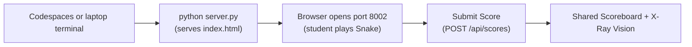

# Mission 02: SnakeGame
Start here when you want a simple game loop that runs in the browser.

Deep dive: [Code Walkthrough](CODE_WALKTHROUGH.md).

Shared browser-mission foundation:

- [../../../docs/SPRK_Browser_Mission_Foundation_Guide.md](../../../docs/SPRK_Browser_Mission_Foundation_Guide.md)

## Start Here
1. Run the mission with `python server.py`.
2. Open the browser link printed by the server.
3. Press `Start Game`.
4. Move with arrow keys, WASD, or the on-screen buttons.
5. Submit your score to the shared board.

## How To Run
```bash
cd missions/02-SnakeGame-1P-nP
python server.py
```



ASCII view:

```text
Terminal -> python server.py -> Browser on port 8002 -> Play -> Submit Score -> Shared board
```

## Entry Point
- App page: [index.html](../index.html)
- Browser logic: [src/app.js](../src/app.js)
- Styling: [src/styles.css](../src/styles.css)
- Backend: [server.py](../server.py)
- Shared helpers: [../_shared](../../_shared/)

## Play It
Snake grows when it eats food. The game ends if the snake hits the wall or itself. Submit your score so all devices connected to the same backend can see it.

## Language Crosswalk In This Mission
Use the repo-wide guide: [../../../docs/SPRK_Language_Crosswalk.md](../../../docs/SPRK_Language_Crosswalk.md)

SnakeGame is a strong example of:

- arrays and iteration: the snake body and board updates
- key-value state: current direction, score, and game status
- callbacks: keyboard input and on-screen controls
- frontend/backend API flow: shared score submission and event logging

## Try Changing One Thing
| Challenge | Hint |
| --- | --- |
| Change the snake color. | Look for the `draw()` function in `src/app.js`. |
| Make the snake move faster. | Change `moveEveryMs` in `src/app.js`. |
| Add bonus food worth more points. | Start in `placeFood()` and `moveSnake()`. |

## Mission-Specific Variation
SnakeGame's main local differences from the shared foundation are:

- the `RealTime` tab is a shared score board for a solo arcade game
- `src/app.js` owns the grid game loop, movement timing, collision, and food logic
- the mission emphasizes arrays, repeated movement updates, and score submission
