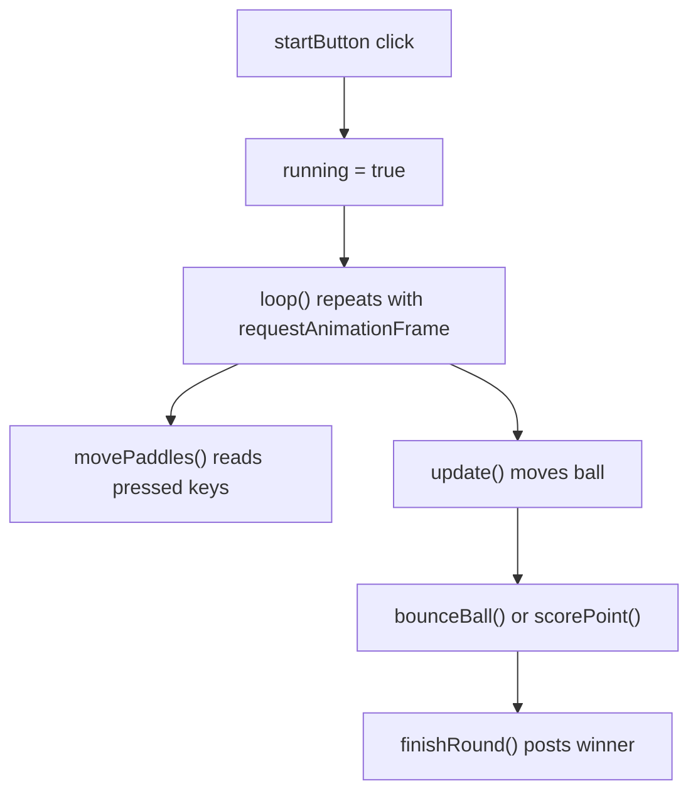

# PingPong Code Walkthrough

## Main Ideas
| Function | Student-Friendly Meaning |
| --- | --- |
| `movePaddles()` | Reads keyboard keys and moves each paddle. |
| `bounceBall()` | Changes ball direction after a paddle hit. |
| `scorePoint()` | Adds a point when the ball passes a paddle. |
| `finishRound()` | Sends the winner to the shared backend. |
| `draw()` | Paints paddles, ball, and center line. |

## Learning Point
Collision is just overlap checking. The code asks, "Is the ball rectangle touching the paddle rectangle?"
