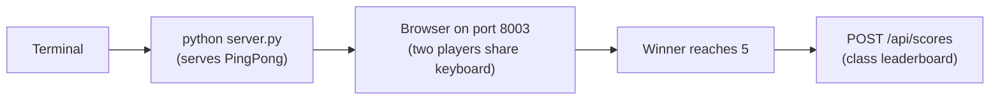

# Mission 03: PingPong
Start here when you want a two-player keyboard game that teaches movement and collisions.

Deep dive: [Code Walkthrough](CODE_WALKTHROUGH.md).

Shared browser-mission foundation:

- [../../../docs/SPRK_Browser_Mission_Foundation_Guide.md](../../../docs/SPRK_Browser_Mission_Foundation_Guide.md)

## Start Here
1. Run the mission with `python server.py`.
2. Open the browser link printed by the server.
3. Player A uses `W/S`; Player B uses `Up/Down`.
4. First player to 5 wins.
5. The winner is posted to the shared scoreboard.

## How To Run
```bash
cd missions/03-PingPong-2P-nP
python server.py
```



ASCII view:

```text
Terminal -> PingPong server -> Browser -> Paddle controls -> Winner -> Shared scoreboard
```

## Entry Point
- App page: [index.html](../index.html)
- Browser logic: [src/app.js](../src/app.js)
- Styling: [src/styles.css](../src/styles.css)
- Backend: [server.py](../server.py)

## Play It
Two people can share one keyboard. A whole class can watch one game and then rotate players, or multiple groups can run their own copies.

## Language Crosswalk In This Mission
Use the repo-wide guide: [../../../docs/SPRK_Language_Crosswalk.md](../../../docs/SPRK_Language_Crosswalk.md)

PingPong is a strong example of:

- state updates: ball movement, paddle movement, and win conditions
- callbacks: keyboard controls and button-driven score actions
- conditional logic: collision and scoring rules
- frontend/backend API flow: winner reports and X-Ray events

## Try Changing One Thing
| Challenge | Hint |
| --- | --- |
| Win at 3 instead of 5. | Change `winningScore` in `src/app.js`. |
| Make the ball faster. | Update `bounceBall()`. |
| Add tournament points. | Change `finishRound()` before it posts the score. |

## Mission-Specific Variation
PingPong's main local differences from the shared foundation are:

- two players share one keyboard on the same screen
- `src/app.js` owns paddle movement, ball physics, and win detection
- the `RealTime` tab represents winner history rather than a live room state
