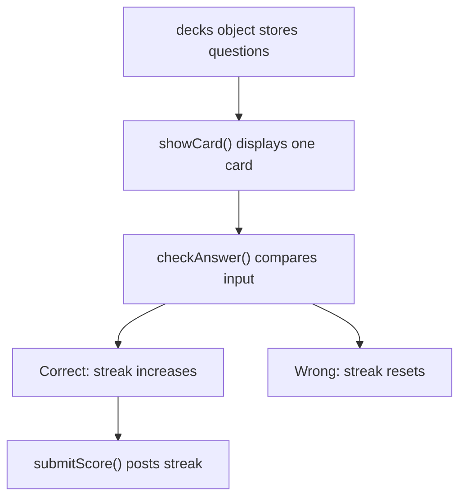

# FlashCards Code Walkthrough

## Main Ideas
| Function | Student-Friendly Meaning |
| --- | --- |
| `currentDeck()` | Picks the active deck from the dropdown. |
| `showCard()` | Places one question on the screen. |
| `checkAnswer()` | Compares the typed answer to the stored answer. |
| `submitScore()` | Sends the streak to the backend. |
| `refreshShared()` | Updates scoreboard and X-Ray Vision. |

## Learning Point
Most useful apps start with data. Here the data is the `decks` object.
