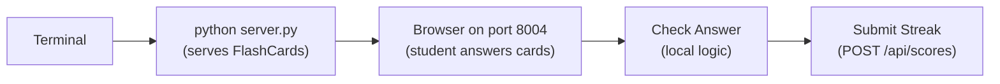

# Mission 04: FlashCards
Start here when you want a useful school practice tool.

Deep dive: [Code Walkthrough](CODE_WALKTHROUGH.md).

Shared browser-mission foundation:

- [../../../docs/SPRK_Browser_Mission_Foundation_Guide.md](../../../docs/SPRK_Browser_Mission_Foundation_Guide.md)

## Start Here
1. Run the mission with `python server.py`.
2. Pick a deck.
3. Answer cards and build a streak.
4. Submit your streak to the shared board.


## Mission Navigation
| Need | Go Here |
| --- | --- |
| I want to run it | [How To Run](#how-to-run) [[#How To Run]] (obsidian) |
| I want to know where the app starts | [Entry Point](#entry-point) [[#Entry Point]] (obsidian) |
| I want to play it | [Play It](#play-it) [[#Play It]] (obsidian) |
| I want language crosswalk in this mission | [Language Crosswalk In This Mission](#language-crosswalk-in-this-mission) [[#Language Crosswalk In This Mission]] (obsidian) |
| I want try changing one thing | [Try Changing One Thing](#try-changing-one-thing) [[#Try Changing One Thing]] (obsidian) |
| I want mission-specific variation | [Mission-Specific Variation](#mission-specific-variation) [[#Mission-Specific Variation]] (obsidian) |

## How To Run
```bash
cd missions/04-FlashCards-1P-nP
python server.py
```



ASCII view:

```text
Terminal -> FlashCards server -> Browser -> Check answer -> Submit streak -> Shared board
```

## Entry Point
- App page: [index.html](../index.html)
- Browser logic: [src/app.js](../src/app.js)
- Styling: [src/styles.css](../src/styles.css)
- Backend: [server.py](../server.py)

## Play It
Students can play alone, then compare streaks on the shared board. A facilitator can host it once and let many devices connect.

## Language Crosswalk In This Mission
Use the repo-wide guide: [../../../docs/SPRK_Language_Crosswalk.md](../../../docs/SPRK_Language_Crosswalk.md)

FlashCards is a strong example of:

- arrays and indexed access: card decks and current card position
- key-value data: prompt, answer, streak, and score values
- string interpolation: status messages and streak displays
- callbacks: reveal, next-card, and submit actions

## Try Changing One Thing
| Challenge | Hint |
| --- | --- |
| Add one card. | Edit `decks.math` or `decks.vocab` in `src/app.js`. |
| Accept multiple correct answers. | Update `checkAnswer()` to compare against a list. |
| Add a timer. | Add `secondsLeft` and update it with `setInterval()`. |

## Mission-Specific Variation
FlashCards' main local differences from the shared foundation are:

- the `RealTime` tab represents shared streaks rather than match state
- `src/app.js` owns deck data, answer checking, and streak tracking
- the mission emphasizes prompt/answer data structures instead of physics or movement
