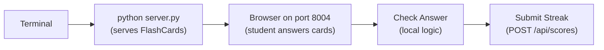

# Mission 04: FlashCards
Start here when you want a useful school practice tool.

Deep dive: [Code Walkthrough](CODE_WALKTHROUGH.md).

## Start Here
1. Run the mission with `python server.py`.
2. Pick a deck.
3. Answer cards and build a streak.
4. Submit your streak to the shared board.

## How To Run
```bash
cd missions/04-FlashCards-1P-nP
python server.py
```



ASCII view:

```text
Terminal -> FlashCards server -> Browser -> Check answer -> Submit streak -> Shared board
```

## Entry Point
- App page: [index.html](../index.html)
- Browser logic: [src/app.js](../src/app.js)
- Styling: [src/styles.css](../src/styles.css)
- Backend: [server.py](../server.py)

## How The Files Work Together
| File | What It Does |
| --- | --- |
| `server.py` | Starts port 8004 and stores shared streaks/events. |
| `index.html` | Creates the deck menu, answer box, buttons, scoreboard, and X-Ray panel. |
| `src/app.js` | Holds the card data, checks answers, tracks streaks, and posts scores. |
| `src/styles.css` | Keeps the card view simple and readable. |

## Play It
Students can play alone, then compare streaks on the shared board. A facilitator can host it once and let many devices connect.

## Try Changing One Thing
| Challenge | Hint |
| --- | --- |
| Add one card. | Edit `decks.math` or `decks.vocab` in `src/app.js`. |
| Accept multiple correct answers. | Update `checkAnswer()` to compare against a list. |
| Add a timer. | Add `secondsLeft` and update it with `setInterval()`. |

## Branch Reminder
Only change code in your own branch, such as `<yourname-sprk>`. Do not edit `main`.
