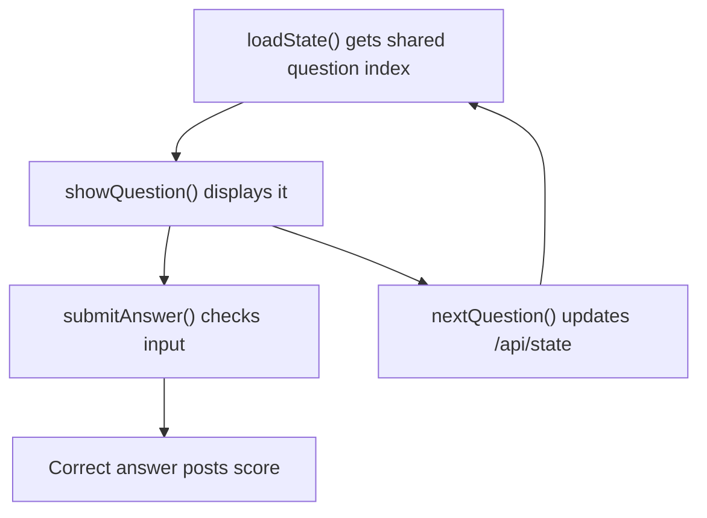

# QuizRoom Code Walkthrough

## Main Ideas
| Function | Student-Friendly Meaning |
| --- | --- |
| `loadState()` | Reads the shared room state from Python. |
| `showQuestion()` | Shows the current question on the screen. |
| `submitAnswer()` | Checks one answer and posts a point if correct. |
| `nextQuestion()` | Changes the shared question for everyone. |
| `refreshShared()` | Updates the board and X-Ray Vision. |

## Learning Point
Shared state lets different devices look at the same classroom moment.
