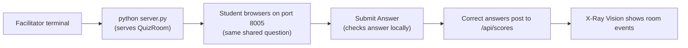

# Mission 05: QuizRoom
Start here when you want many students answering the same live classroom question.

Deep dive: [Code Walkthrough](CODE_WALKTHROUGH.md).

## Start Here
1. Run the mission with `python server.py`.
2. Open the browser link on each student device.
3. Everyone answers the current question.
4. The facilitator clicks `Next` to move the room forward.

## How To Run
```bash
cd missions/05-QuizRoom-nP
python server.py
```



ASCII view:

```text
Facilitator laptop -> QuizRoom server -> Many browsers -> Answers -> Shared score + X-Ray
```

## Entry Point
- App page: [index.html](../index.html)
- Browser logic: [src/app.js](../src/app.js)
- Styling: [src/styles.css](../src/styles.css)
- Backend: [server.py](../server.py)

## How The Files Work Together
| File | What It Does |
| --- | --- |
| `server.py` | Starts port 8005 and stores the shared question index. |
| `index.html` | Creates the answer form, next-question control, scoreboard, and X-Ray panel. |
| `src/app.js` | Checks answers, advances shared question state, and posts correct responses. |
| `src/styles.css` | Makes the current question easy to read. |

## Play It
One person can act as facilitator. Other devices open the same link. The shared question index lets everyone stay on the same question after the facilitator advances it.

## Language Crosswalk In This Mission
Use the repo-wide guide: [../../../docs/SPRK_Language_Crosswalk.md](../../../docs/SPRK_Language_Crosswalk.md)

QuizRoom is a strong example of:

- shared key-value state: current question, answers, and room progress
- form validation: checking whether player input is acceptable
- callbacks: submit actions and room-control buttons
- frontend/backend API flow: browser updates to shared classroom state

## Try Changing One Thing
| Challenge | Hint |
| --- | --- |
| Add a question. | Edit the `questions` array in `src/app.js`. |
| Add harder-question points. | Add `points` to each question and use it in `submitAnswer()`. |
| Add teams. | Add a team input in `index.html` and include it in the score detail. |

## Branch Reminder
Only change code in your own branch, such as `<yourname-sprk>`. Do not edit `main`.
