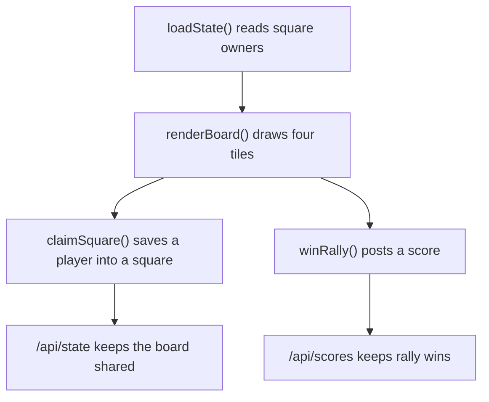

# FourSquare Code Walkthrough

## Main Ideas
| Function | Student-Friendly Meaning |
| --- | --- |
| `loadState()` | Gets the latest square board from Python. |
| `renderBoard()` | Builds the four visible square tiles. |
| `claimSquare()` | Writes a player's name into one square. |
| `winRally()` | Adds a point for the player in a square. |
| `nextRound()` | Moves the game into another round. |

## Learning Point
The browser does not remember the whole classroom by itself. The backend stores the shared board so other devices can see it.
