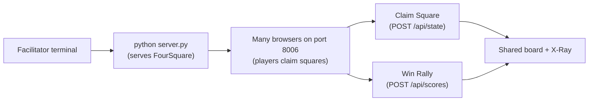

# Mission 06: FourSquare
Start here when you want to model a real-world group game as software state.

Deep dive: [Code Walkthrough](CODE_WALKTHROUGH.md).

## Start Here
1. Run the mission with `python server.py`.
2. Open the link on multiple devices.
3. Players claim squares.
4. Click `Win Rally` when a square wins the rally.
5. Watch scores and events update.

## How To Run
```bash
cd missions/06-FourSquare-nP
python server.py
```



ASCII view:

```text
Laptop server -> Shared square board -> Students claim squares -> Rallies add points
```

## Entry Point
- App page: [index.html](../index.html)
- Browser logic: [src/app.js](../src/app.js)
- Styling: [src/styles.css](../src/styles.css)
- Backend: [server.py](../server.py)

## How The Files Work Together
| File | What It Does |
| --- | --- |
| `server.py` | Starts port 8006 and stores squares plus round number. |
| `index.html` | Creates round controls, square board, scoreboard, and X-Ray panel. |
| `src/app.js` | Claims squares, records rally wins, and syncs shared state. |
| `src/styles.css` | Lays out the four tiles clearly. |

## Play It
This can be used as a digital scoreboard for a physical classroom game. Students can also redesign the rules and turn it into a completely new playground-style game.

## Try Changing One Thing
| Challenge | Hint |
| --- | --- |
| Rename squares. | Edit `squareNames` in `src/app.js`. |
| Make square A worth more. | Update `winRally(square)`. |
| Track eliminated players. | Store an `outPlayers` list in `/api/state`. |

## Branch Reminder
Only change code in your own branch, such as `<yourname-sprk>`. Do not edit `main`.
