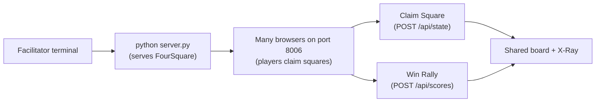

# Mission 06: FourSquare
Start here when you want to model a real-world group game as software state.

Deep dive: [Code Walkthrough](CODE_WALKTHROUGH.md).

Shared browser-mission foundation:

- [../../../docs/SPRK_Browser_Mission_Foundation_Guide.md](../../../docs/SPRK_Browser_Mission_Foundation_Guide.md)

## Start Here
1. Run the mission with `python server.py`.
2. Open the link on multiple devices.
3. Players claim squares.
4. Click `Win Rally` when a square wins the rally.
5. Watch scores and events update.


## Mission Navigation
| Need | Go Here |
| --- | --- |
| I want to run it | [How To Run](#how-to-run) [[#How To Run]] (obsidian) |
| I want to know where the app starts | [Entry Point](#entry-point) [[#Entry Point]] (obsidian) |
| I want to play it | [Play It](#play-it) [[#Play It]] (obsidian) |
| I want language crosswalk in this mission | [Language Crosswalk In This Mission](#language-crosswalk-in-this-mission) [[#Language Crosswalk In This Mission]] (obsidian) |
| I want try changing one thing | [Try Changing One Thing](#try-changing-one-thing) [[#Try Changing One Thing]] (obsidian) |
| I want mission-specific variation | [Mission-Specific Variation](#mission-specific-variation) [[#Mission-Specific Variation]] (obsidian) |

## How To Run
```bash
cd missions/06-FourSquare-nP
python server.py
```



ASCII view:

```text
Laptop server -> Shared square board -> Students claim squares -> Rallies add points
```

## Entry Point
- App page: [index.html](../index.html)
- Browser logic: [src/app.js](../src/app.js)
- Styling: [src/styles.css](../src/styles.css)
- Backend: [server.py](../server.py)

## Play It
This can be used as a digital scoreboard for a physical classroom game. Students can also redesign the rules and turn it into a completely new playground-style game.

## Language Crosswalk In This Mission
Use the repo-wide guide: [../../../docs/SPRK_Language_Crosswalk.md](../../../docs/SPRK_Language_Crosswalk.md)

FourSquare is a strong example of:

- shared state objects: players, turns, and square ownership
- state transitions: who serves next and how rounds advance
- arrays and iteration: player lists and square ordering
- frontend/backend API flow: synchronized classroom game state

## Try Changing One Thing
| Challenge | Hint |
| --- | --- |
| Rename squares. | Edit `squareNames` in `src/app.js`. |
| Make square A worth more. | Update `winRally(square)`. |
| Track eliminated players. | Store an `outPlayers` list in `/api/state`. |

## Mission-Specific Variation
FourSquare's main local differences from the shared foundation are:

- the `RealTime` tab represents shared square ownership and rally scores
- `src/app.js` owns turn/rally state transitions
- the mission emphasizes modeling a real-world group game as shared software state
