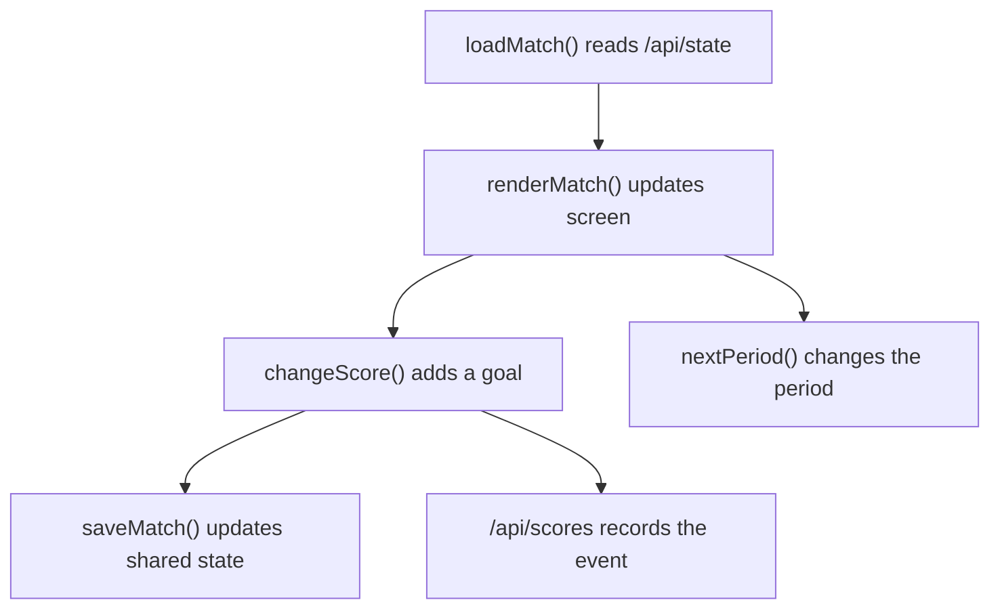

# SoccerScore Code Walkthrough

## Main Ideas
| Function | Student-Friendly Meaning |
| --- | --- |
| `loadMatch()` | Gets the latest match from the backend. |
| `renderMatch()` | Shows team names, scores, and period. |
| `changeScore()` | Adds one goal and records an event. |
| `saveTeams()` | Stores new team names. |
| `nextPeriod()` | Moves to the next period. |

## Learning Point
A scoreboard is a data app. The display looks simple, but the important part is keeping the shared data correct.
