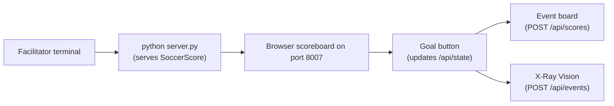

# Mission 07: SoccerScore
Start here when you want a shared scoreboard for sports or classroom teams.

Deep dive: [Code Walkthrough](CODE_WALKTHROUGH.md).

## Start Here
1. Run the mission with `python server.py`.
2. Open the link on the scoreboard device and reporter devices.
3. Rename teams if needed.
4. Tap a goal button when a team scores.
5. Watch the shared event board and X-Ray Vision.

## How To Run
```bash
cd missions/07-SoccerScore-nP
python server.py
```



ASCII view:

```text
Laptop server -> Scoreboard browser -> Goal button -> Shared match state + event list
```

## Entry Point
- App page: [index.html](../index.html)
- Browser logic: [src/app.js](../src/app.js)
- Styling: [src/styles.css](../src/styles.css)
- Backend: [server.py](../server.py)

## How The Files Work Together
| File | What It Does |
| --- | --- |
| `server.py` | Starts port 8007 and stores match state. |
| `index.html` | Creates team name inputs, score buttons, event board, and X-Ray panel. |
| `src/app.js` | Updates scores, periods, team names, and shared events. |
| `src/styles.css` | Makes the score large enough to see quickly. |

## Play It
One device can be the scoreboard. Other devices can report goals if they are connected to the same backend link. This mission can become a soccer, football, softball, basketball, or classroom tournament tracker.

## Try Changing One Thing
| Challenge | Hint |
| --- | --- |
| Rename the sport. | Change the title text in `index.html`. |
| Add score correction buttons. | Copy the goal button pattern and subtract in `changeScore()`. |
| Add event types. | Add buttons that send text to `/api/events`. |

## Branch Reminder
Only change code in your own branch, such as `<yourname-sprk>`. Do not edit `main`.
