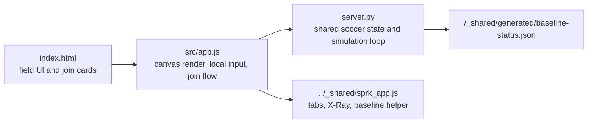

# SoccerMatch Code Walkthrough

## File Map
```text
08-SoccerMatch-nP/
  index.html
  server.py
  src/
    app.js
    styles.css
  docs/
    MISSION_GUIDE.md
    CODE_WALKTHROUGH.md
```

## Main Split


## Backend Idea
`server.py` owns the live world:
- players
- ball
- teams
- score
- match clock
- event log

The server ticks the simulation on a background loop. Clients do not decide where the ball really is. They only send control input.

## Frontend Idea
`src/app.js` does four jobs:
1. join local players
2. collect keyboard input for each control scheme
3. poll the shared world state
4. draw the soccer field and players on the canvas

## Key APIs
- `GET /api/state`: whole live match snapshot
- `POST /api/join`: join or rejoin one player slot
- `POST /api/input`: send movement, turn, and kick input
- `POST /api/teams`: rename the home and away teams
- `DELETE /api/state`: reset the match
- `GET /api/events`: X-Ray event stream

## Why This Mission Matters
This mission is the first browser-first example in the repo where:
- the game is live across devices
- the backend runs a simulation loop
- the frontend becomes a client for a shared world rather than the only place where the game exists
