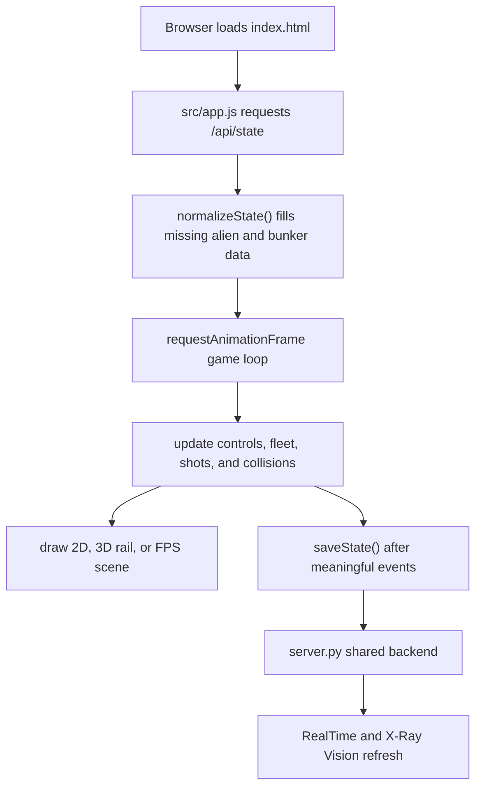
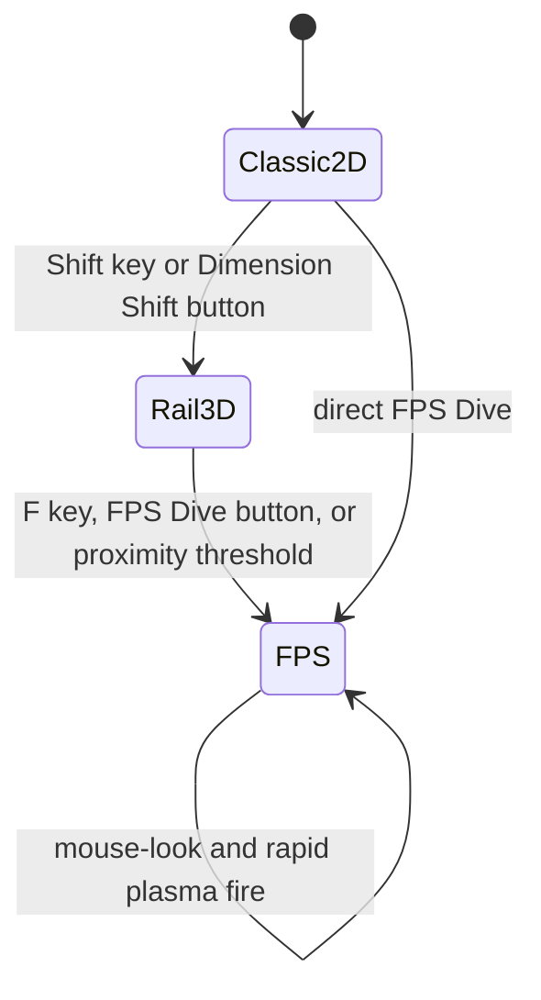

# Space Invaders: Dimensional Shift Code Walkthrough
This walkthrough explains how Mission 10 uses the shared browser mission baseline while adding a three-view game state machine.

## File Map
```text
10-Space-Invaders/
  index.html
    The mission page, canvas, controls, and shared RealTime/X-Ray/Baseline panel.

  src/styles.css
    Mission-specific layout, canvas styling, and responsive controls.

  src/app.js
    Game state, alien rules, bunker destruction, camera modes, rendering, and shared API calls.

  server.py
    The tiny mission backend that reuses missions/_shared/sprk_backend.py.

  docs/MISSION_GUIDE.md
    Student-facing run guide and challenge prompts.

  docs/CODE_WALKTHROUGH.md
    This architecture explanation.
```

## Why The Game Uses One State Object
The central object is `gameState`. It stores:

- `mode`: `2d`, `lateral3d`, or `fps`
- `score`, `wave`, and `lives`
- every alien's type, position, and alive/dead status
- every bunker's live/dead voxel cells
- player position and FPS aim
- mystery ship and fleet timing data

Changing the camera does not rebuild the game. The render and controls change, but the same aliens, bunkers, score, and wave continue through each dimensional view.

## State Flow


ASCII fallback:

```text
index.html -> src/app.js -> /api/state
                     |
                     +-> game loop updates one gameState
                     +-> renderer chooses 2D, 3D rail, or FPS
                     +-> /api/scores and /api/events feed shared panels
```

## Dimensional State Machine


`startTransition()` owns mode changes. The 2D to 3D rail shift uses a 1.5 second transition so the player sees the flat grid become a perspective runway.

## Classic 2D Rules
The 2D mode follows the recognizable Space Invaders loop:

1. The player cannon moves left and right near the bottom.
2. Space fires one classic laser at a time.
3. Aliens move as one grid and drop when the fleet hits an edge.
4. Destroyed aliens increase the score.
5. Remaining aliens accelerate because `fleetIntervalSeconds()` gets smaller.
6. Four bunkers degrade as lasers remove individual cells.
7. A red mystery ship crosses the top for bonus points.

## 3D Rail Rules
The 3D rail mode keeps the same fleet but changes interpretation:

- alien `x` still shuffles left and right
- alien `z` advances toward the player
- bunkers become geometric barriers on the runway
- camera projection uses `projectRail()`
- shots travel along the z-axis

This is not a separate level. It is the same wave viewed from a new camera.

## FPS Rules
The FPS mode changes controls and fire rate:

- WASD moves the player on a ground plane
- Q/E strafe left and right
- mouse movement or test hooks adjust yaw/pitch
- Space/click fires rapid plasma using a ray-style hit check
- `projectFps()` draws the same aliens from the player's vector

## Rendering Responsibilities
| Function | Purpose |
| --- | --- |
| `draw2DScene()` | Classic black playfield, pixel aliens, bunkers, cannon, and lasers. |
| `drawDimensionalBlend()` | Interpolates aliens and background from 2D into the runway view. |
| `drawRailScene()` | Draws the grid runway, projected aliens, bunkers, cannon, and plasma. |
| `drawFpsScene()` | Draws the skybox, projected aliens, crosshair, and weapon view. |
| `drawAlienIcon()` | Reuses the iconic alien matrices in every mode. |

## Shared Backend Responsibilities
`server.py` stays intentionally small. It decides:

- mission folder
- mission title
- port `8010`
- initial state keys for the shared backend

The common backend in `missions/_shared/sprk_backend.py` handles:

- serving files
- `/api/state`
- `/api/scores`
- `/api/events`
- generated baseline status files

## Test Hooks
`window.__sprkTest` exposes deterministic helpers for Playwright:

- `getState()`
- `resetGame()`
- `destroyFirstAlienForTest()`
- `hitFirstBunkerForTest()`
- `shiftToLateral()`
- `enterFps()`
- `lookForTest()`
- `fireAtFirstAlienForTest()`

These hooks avoid relying on random alien shots or exact frame timing while still validating the real mission state.

## Extension Ideas
- Add multiplayer operators that share the same wave.
- Replace the canvas renderer with Three.js while keeping the same `gameState` contract.
- Add boss waves where the mystery ship becomes a 3D mothership.
- Add a classroom challenge where teams design different bunker shapes.
