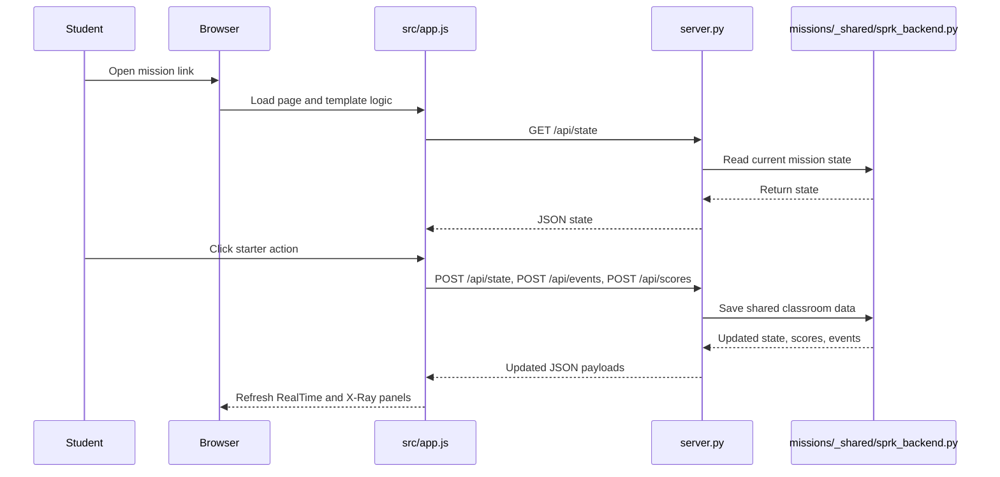
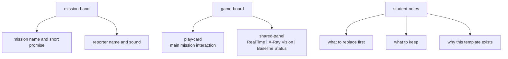

# Template Mission Code Walkthrough
This walkthrough explains the baseline structure that new browser-first SPRK missions should follow.

## File Map
```text
XX-Template-nP/
  index.html
    The mission page structure.

  src/styles.css
    Template-specific mission visuals.

  src/app.js
    The mission behavior, score calls, state calls, and tab setup.

  server.py
    The tiny mission backend that reuses missions/_shared/sprk_backend.py.

  docs/MISSION_GUIDE.md
    The student mission guide.

  docs/CODE_WALKTHROUGH.md
    This architecture explanation.
```

## Why This Template Exists
The repo already learned several good patterns:

- keep each mission self-contained under `missions/<MissionName>/`
- keep shared browser helpers in `missions/_shared/`
- keep mission docs with the mission
- keep the repo root for workspace-level files only
- keep `RealTime`, `X-Ray Vision`, and `Baseline Status` as the stable right-side tab model

This template turns those learnings into one copyable starting point.

## Interaction Diagram


## Page Layout


## Minimal Frontend Responsibilities
`src/app.js` should usually do five things:

1. connect JavaScript to the HTML elements
2. load current shared state from `/api/state`
3. send score or state updates back to the backend
4. refresh `RealTime` and `X-Ray Vision`
5. load repo-level baseline results into `Baseline Status`

If a new mission starts repeating logic already covered by `missions/_shared/sprk_app.js`, move that logic into the shared helper instead of cloning it again.

## Minimal Backend Responsibilities
`server.py` should usually only decide:

- mission folder
- mission title
- port number
- initial mission state

The shared backend already handles:

- serving files
- shared scores
- shared events
- shared mission state
- baseline generated files under `/_shared/generated/`

## Root Hygiene Rule
The following files do not belong in the repo root when they are mission-specific:

- `index.html`
- `app.js`
- `styles.css`
- `server.py`
- mission-specific `MISSION_GUIDE.md`
- mission-specific `CODE_WALKTHROUGH.md`

Those belong inside the mission folder. Root is for workspace-level control files such as `README.md`, `package.json`, `VERSION`, `tests/`, `docs/`, and `missions/`.
