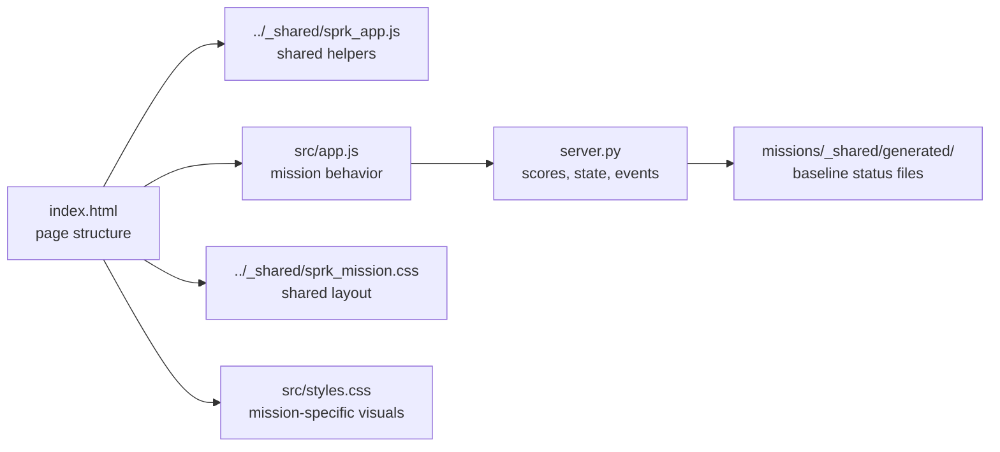

# Mission XX: Template Mission
Use this mission as the baseline when creating the next browser-first SPRK project.

## Start Here
1. Run the template once before changing it.
2. Read the file map and diagrams.
3. Replace the mission name, promise, and starter card.
4. Replace the shared score format so `RealTime` matches the real mission.
5. Keep the shared backend, `X-Ray Vision`, and `Baseline Status` pattern.

## Mission Navigation
| Need | Go Here |
| --- | --- |
| I want to run the template | [How To Run](#how-to-run) |
| I want to know where the app starts | [Entry Point](#entry-point) |
| I want the file map | [Code Files](#code-files) |
| I want the deeper architecture view | [CODE_WALKTHROUGH.md](CODE_WALKTHROUGH.md) |
| I need the shared Git workflow | [SPRK Git Repository User Guide](../../../docs/SPRK_Git_Repository_UserGuide.md) |
| I want the common browser mission pattern | [../../../docs/SPRK_Browser_Mission_Foundation_Guide.md](../../../docs/SPRK_Browser_Mission_Foundation_Guide.md) |

## What This Template Gives You
- A working mission folder under `missions/`
- Shared backend wiring through `server.py`
- Shared frontend helpers through `../_shared/sprk_app.js`
- The stable three-tab panel:
  - `RealTime`
  - `X-Ray Vision`
  - `Baseline Status`
- Student-facing docs:
  - `MISSION_GUIDE.md`
  - `CODE_WALKTHROUGH.md`
- Language crosswalk alignment through [../../../docs/SPRK_Language_Crosswalk.md](../../../docs/SPRK_Language_Crosswalk.md)

## How To Run
```bash
cd missions/XX-Template-nP
python server.py
```

What each command does:

- `cd missions/XX-Template-nP`: moves the terminal into the mission folder.
- `python server.py`: starts the local backend and serves the mission page.

Open the browser link shown in the terminal. The template currently uses port `8010`.

## Entry Point
Start with:

```text
missions/XX-Template-nP/index.html
```

`index.html` defines what students see on the page. It loads the shared mission CSS, template CSS, shared mission helpers, and template app logic.

## Code Files
| File | What It Does | What You Usually Change First |
| --- | --- | --- |
| `index.html` | Page structure and student-facing sections. | Mission title, controls, labels, and card layout. |
| `src/app.js` | Frontend mission behavior. | Real gameplay logic, events, state updates, and score formatting. |
| `src/styles.css` | Template-specific mission visuals. | Card layout, spacing, colors, and mission-specific visuals. |
| `server.py` | Shared backend startup. | Port, mission title, and initial state. |
| `docs/MISSION_GUIDE.md` | Student mission instructions. | Mission goal, run steps, and starter change ideas. |
| `docs/CODE_WALKTHROUGH.md` | Deeper code explanation and diagrams. | Function map, state flow, and architecture notes. |

## How The Files Work Together


ASCII fallback:

```text
index.html
  -> shared CSS and local CSS
  -> shared JS helpers and local app.js
  -> server.py for scores, state, and events
  -> shared generated baseline files for Baseline Status
```

## What To Replace In A New Mission
1. Mission number and title
2. Short promise in the top band
3. Main gameplay or classroom interaction card
4. Score detail and score formatting
5. Student notes and challenge prompts
6. Port number and initial state in `server.py`

## What To Keep In Every New Mission
1. The shared mission backend pattern
2. The three-tab right panel
3. The mission guide and code walkthrough docs
4. The repo-level baseline validation path
5. The clean folder rule: mission files stay in the mission folder, not the repo root
6. A mission-level callout to the language crosswalk concepts used in that mission
